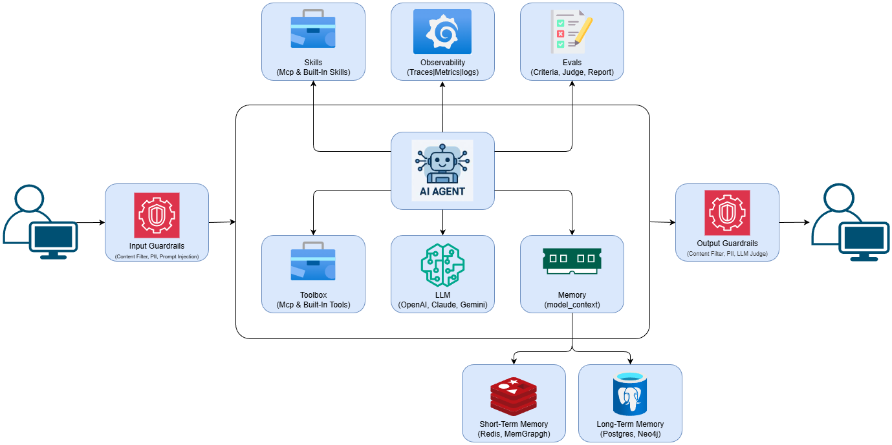
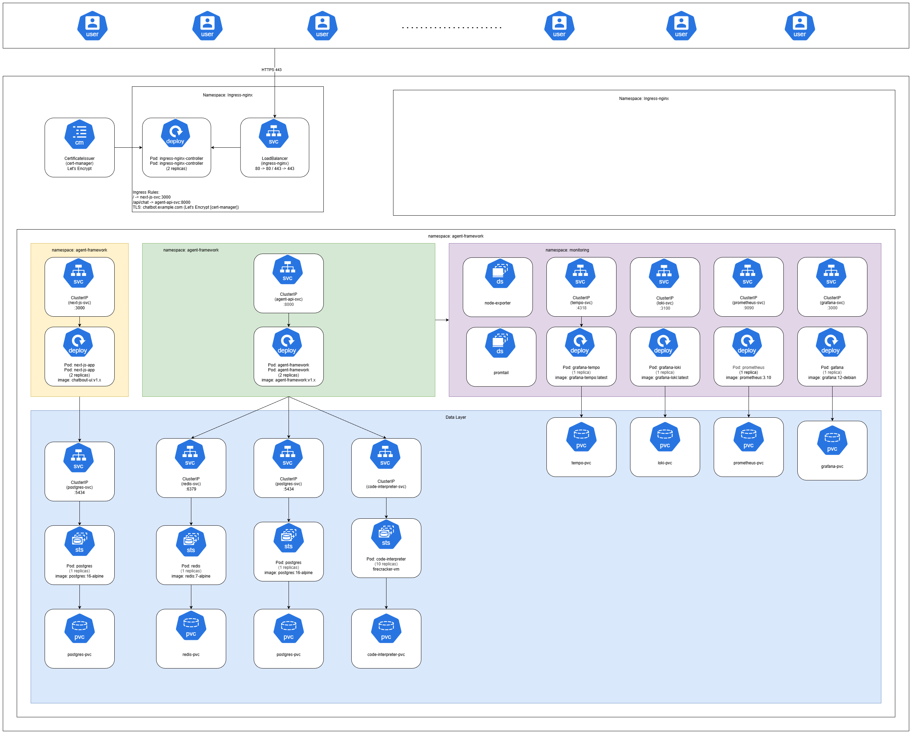
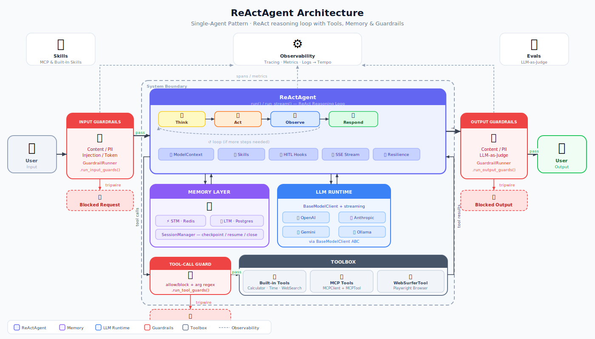
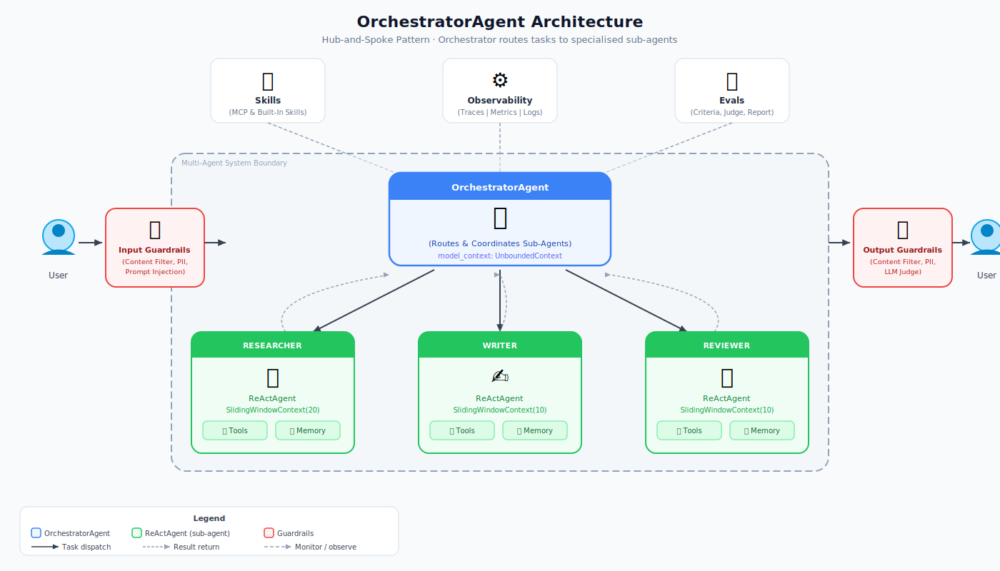
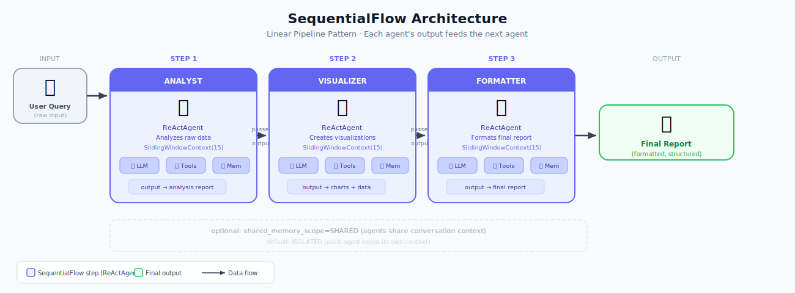
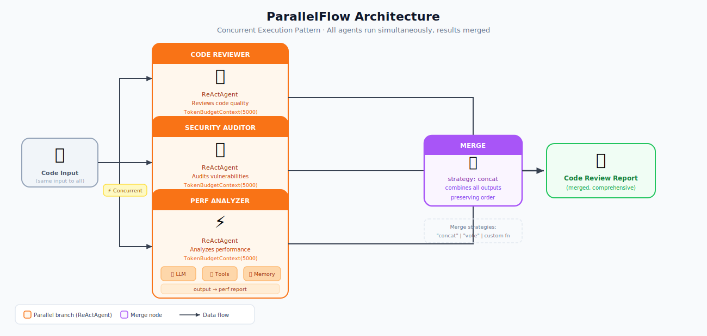
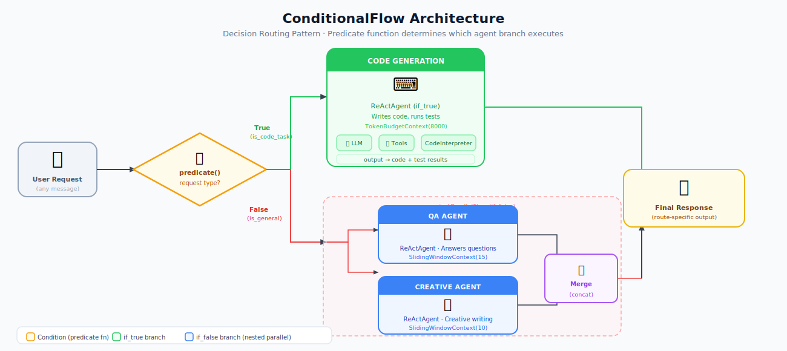

<center><h1>Agent Framework</h1></center>

**A production-ready Python framework for building autonomous AI agents with tool calling, memory management, and observability.**

[](https://www.python.org/downloads/)
[](https://opensource.org/licenses/MIT)

---

## 🚀 Features

- **🤖 Multiple Agent Types**: ReAct, Conversational, Planner (coming soon)
- **🔧 Tool Calling**: OpenAI-compatible function calling with JSON Schema validation
- **🔌 MCP Support**: Connect to external tools via Model Context Protocol
- **💾 Memory Management**: Multiple strategies (unbounded, sliding window, token-limited)
- **🎯 Multi-Provider**: OpenAI, Anthropic, Gemini, Ollama (expanding)
- **📊 Observability**: Built-in logging, tracing, and metrics
- **⚡ Async-First**: Efficient I/O with full async/await support
- **🔒 Type-Safe**: Pydantic models throughout with comprehensive type hints
- **🎨 Extensible**: Protocol-oriented design for easy customization





## 📋 Table of Contents

- [Quick Start](#quick-start)
- [Installation](#installation)
- [Core Concepts](#core-concepts)
- [Examples](#examples)
- [Documentation](#documentation)
- [Architecture](#architecture)
- [Multi-Agent Architectures](#multi-agent-architectures)
- [Contributing](#contributing)
- [License](#license)

---

## ⚡ Quick Start

### Installation

```bash
# Clone the repository
git clone https://github.com/yourusername/agent-framework.git
cd agent-framework

# Install with uv
uv sync

# Or with pip
pip install -e .

# Set your API key
export OPENAI_API_KEY="sk-your-key-here"
```

### Your First Agent (60 seconds)

```python
import asyncio
from agent_framework.providers.llm.openai.openai_client import OpenAIClient
from agent_framework.memory.unbounded_memory import UnboundedMemory
from agent_framework.messages.agent_messages import UserMessage, SystemMessage

async def main():
    # Initialize components
    client = OpenAIClient(model="gpt-4o")
    memory = UnboundedMemory()
    
    # Add system instructions
    memory.add_message(SystemMessage(
        content="You are a helpful Python programming assistant."
    ))
    
    # Add user message
    memory.add_message(UserMessage(
        content="How do I read a CSV file in pandas?"
    ))
    
    # Get response
    response = await client.generate(messages=memory.get_messages())
    print(f"Assistant: {response.content}")

asyncio.run(main())
```

### Agent with Tools

```python
import asyncio
import json
from agent_framework.model_clients.openai_client import OpenAIClient
from agent_framework.memory.unbounded_memory import UnboundedMemory
from agent_framework.messages.agent_messages import UserMessage, ToolMessage
from agent_framework.tools.builtin_tools import CalculatorTool

async def main():
    client = OpenAIClient(model="gpt-4o")
    memory = UnboundedMemory()
    tools = [CalculatorTool()]
    
    memory.add_message(UserMessage(content="What's 1234 * 5678?"))
    
    # Tool calling loop
    for _ in range(5):
        response = await client.generate(
            messages=memory.get_messages(),
            tools=[t.get_schema() for t in tools]
        )
        
        if not response.tool_calls:
            print(f"Final answer: {response.content}")
            break
        
        memory.add_message(response)
        
        # Execute tools
        for tool_call in response.tool_calls:
            tool = next(t for t in tools if t.name == tool_call.function["name"])
            result = await tool.execute(
                **json.loads(tool_call.function["arguments"])
            )
            memory.add_message(ToolMessage(
                content=result,
                tool_call_id=tool_call.id,
                name=tool.name
            ))

asyncio.run(main())
```

---

## 🏗️ Core Concepts

### Messages

Structured communication between agents, users, and tools:

```python
from agent_framework.messages.agent_messages import (
    SystemMessage,    # System instructions
    UserMessage,      # User inputs
    AssistantMessage, # Agent responses
    ToolMessage      # Tool results
)
```

### Model Clients

Abstraction layer for different LLM providers:

```python
from agent_framework.model_clients.openai_client import OpenAIClient

client = OpenAIClient(
    model="gpt-4o",
    temperature=0.7,
    max_tokens=2000
)
```

### Tools

Function calling with JSON Schema validation:

```python
from agent_framework.tools.base_tool import BaseTool

class MyTool(BaseTool):
    async def execute(self, **kwargs):
        # Your logic here
        return json.dumps(result)
    
    def get_schema(self):
        # OpenAI function calling format
        return {...}
```

### Memory

Conversation history management:

```python
from agent_framework.memory.unbounded_memory import UnboundedMemory

memory = UnboundedMemory()
memory.add_message(message)
messages = memory.get_messages()
```

### MCP Tools

Connect to external tools via Model Context Protocol:

```python
from agent_framework.tools import MCPClient, MCPTool

# Connect to MCP server
mcp_client = MCPClient()
await mcp_client.connect(
    command="npx",
    args=["-y", "@modelcontextprotocol/server-filesystem", "/tmp"]
)

# Auto-discover and create tools
tools = await MCPTool.from_mcp_client(mcp_client)

# Use with your agent
agent = ReActAgent(tools=tools, ...)
```

---

## 📚 Examples

Check the `examples/` directory for complete examples:

- **[simple_agent.py](examples/simple_agent.py)** - Basic conversational agent
- **[agent_with_tools.py](examples/agent_with_tools.py)** - Tool-calling agent
- **[streaming_agent.py](examples/streaming_agent.py)** - Streaming responses
- **[custom_tools.py](examples/custom_tools.py)** - Creating custom tools
- **More coming soon...**

---

## 📖 Documentation

### Core Documentation

- **[Getting Started Guide](docs/GETTING_STARTED.md)** - 10-minute quickstart
- **[Architecture](docs/ARCHITECTURE.md)** - System design and principles
- **[API Reference](docs/API_REFERENCE.md)** - Complete API documentation
- **[Component Specifications](docs/COMPONENT_SPECS.md)** - Detailed specs
- **[Roadmap](docs/ROADMAP.md)** - Future plans and features

### Component Guides

- **Messages** - Structured communication
- **Model Clients** - LLM provider integration
- **Tools** - Function calling system
- **Memory** - Conversation management
- **Agents** - Autonomous orchestration
- **Observability** - Monitoring and debugging

---

## 🏛️ Architecture

> **Full details, extension guides, and data-flow diagrams:**
> [`ARCHITECTURE.md`](ARCHITECTURE.md)

### Codebase layers

The codebase is structured as five dependency layers.  Dependencies flow strictly
downward — lower layers never import from higher ones:

```
server        ← FastAPI routes, DB models, DI wiring
  runtime     ← HITL bridge, tasks, credentials, telemetry
    extensions← tools, MCP, skills, guardrails (plug-ins)
      providers← LLM clients, audio clients, third-party API adapters
        core  ← agents, base classes, pure logic (no I/O)
```

**Import paths** (files are physically in these locations):

```python
# Core — agents, base classes, memory
from agent_framework.core.agents.react_agent import ReActAgent
from agent_framework.core.agents.orchestrator_agent import OrchestratorAgent
from agent_framework.core.memory.unbounded_memory import UnboundedMemory
from agent_framework.core.memory.session_manager import SessionManager
from agent_framework.core.guardrails.base_guardrail import BaseGuardrail

# Providers — LLM clients, audio, third-party APIs
from agent_framework.providers.llm.openai.openai_client import OpenAIClient
from agent_framework.providers.audio import BaseAudioClient
from agent_framework.providers.integrations.spotify import SpotifyService

# Extensions — tools, MCP, skills
from agent_framework.extensions.tools.base_tool import BaseTool, ToolResult
from agent_framework.extensions.tools.web_surfer import WebSurferTool
from agent_framework.extensions.tools.human_input import AskHumanTool
from agent_framework.extensions.tools.mcp_client import MCPClient
from agent_framework.extensions.skills import SkillManager

# Runtime — HITL, tasks, credentials, telemetry
from agent_framework.runtime.hitl import WebHITLBridge
from agent_framework.runtime.tasks.store import TaskStore
from agent_framework.runtime.observability import configure_opentelemetry
```

### Common extension tasks — quick reference

| Task | Guide in ARCHITECTURE.md |
|---|---|
| Add a new tool | [→ How to add a new tool](ARCHITECTURE.md#how-to-add-a-new-tool) |
| Add a new LLM provider | [→ How to add a new LLM provider](ARCHITECTURE.md#how-to-add-a-new-llm-provider) |
| Add a new agent type | [→ How to add a new agent type](ARCHITECTURE.md#how-to-add-a-new-agent-type) |
| Add a new guardrail | [→ How to add a new guardrail](ARCHITECTURE.md#how-to-add-a-new-guardrail) |
| Add a new skill | [→ How to add a new skill](ARCHITECTURE.md#how-to-add-a-new-skill) |
| Add a new API route | [→ How to add a new API route](ARCHITECTURE.md#how-to-add-a-new-api-route) |
| Emit a real-time SSE event | [→ How to emit a real-time event](ARCHITECTURE.md#how-to-emit-a-real-time-event-to-the-frontend) |
| Add an MCP App UI widget | [→ How to add a new MCP App](ARCHITECTURE.md#how-to-add-a-new-mcp-app-ui-widget) |

### Single-Agent Architecture



Editable source: [agent-architectures.drawio](public/diagrams/agent-architectures.drawio) (page: "Single Agent")

**Key Design Principles:**

1. **Protocol-Oriented** - Abstract interfaces, swappable implementations
2. **Type-Safe** - Pydantic models with full type hints
3. **Async-First** - Efficient I/O operations
4. **Production-Ready** - Error handling, observability, testing
5. **Extensible** - Easy to add providers, tools, agents

---

## 🕸️ Multi-Agent Architectures

The framework supports four first-class multi-agent composition patterns.
Each pattern is a first-class Python class — compose them freely and nest arbitrarily.

Editable source for all diagrams: [agent-architectures.drawio](public/diagrams/agent-architectures.drawio)

### OrchestratorAgent — Hub & Spoke

An `OrchestratorAgent` routes tasks to specialised sub-agents and aggregates their results.
Ideal for workflows that require multiple domain experts working under a single coordinator.



```python
from agent_framework import OrchestratorAgent, ReActAgent

orchestrator = OrchestratorAgent(
    name="coordinator",
    model_client=client,
    model_context=UnboundedContext(),
    sub_agents=[researcher, writer, reviewer],
)
```

---

### SequentialFlow — Linear Pipeline

Agents execute one after another; each agent receives the output of the previous step.
Perfect for ETL pipelines, report generation, and multi-stage transformation workflows.



```python
from agent_framework import SequentialFlow

pipeline = SequentialFlow(
    name="etl_pipeline",
    steps=[extractor, transformer, formatter],
)
```

---

### ParallelFlow — Concurrent Execution

All branch agents run simultaneously; results are merged according to a configurable strategy.
Ideal for independent analyses, multi-perspective reviews, and latency-critical workflows.



```python
from agent_framework import ParallelFlow

reviewer = ParallelFlow(
    name="code_review",
    branches=[code_reviewer, security_auditor, perf_analyzer],
    merge_strategy="concat",   # or "vote" or custom callable
)
```

---

### ConditionalFlow — Decision Routing

A predicate function inspects the input and routes execution to either `if_true` or `if_false`.
Branches can themselves be any agent or flow, enabling arbitrarily deep decision trees.



```python
from agent_framework import ConditionalFlow

router = ConditionalFlow(
    name="smart_router",
    predicate=lambda ctx: "code" in ctx.last_message.lower(),
    if_true=code_gen_agent,
    if_false=ParallelFlow(branches=[qa_agent, creative_agent]),
)
```

---

## 🔧 Installation & Setup

### Requirements

- Python 3.13+
- OpenAI API key (or other LLM provider)

### Install Dependencies

```bash
# Using uv (recommended)
uv sync

# Using pip
pip install -e .

# Development dependencies
uv sync --group dev
```

### Environment Variables

Create a `.env` file:

```bash
OPENAI_API_KEY=sk-your-key-here
ANTHROPIC_API_KEY=sk-ant-your-key
LOG_LEVEL=INFO
```

---

## 🧪 Testing

```bash
# Run tests
pytest

# With coverage
pytest --cov=agent_framework

# Run specific test
pytest tests/test_messages.py
```

---

## 🛣️ Roadmap

### ✅ Phase 1: Foundation (Current)
- Core message types
- OpenAI client
- Tool system
- Basic memory
- Documentation

### 🚧 Phase 2: Core Agents (Next)
- ReAct agent implementation
- Advanced memory strategies
- Error handling
- Configuration system

### 📋 Phase 3: Production (Future)
- Multi-provider support
- Observability (tracing, metrics)
- More built-in tools
- State persistence

### 🚀 Phase 4: Advanced (Future)
- Multi-agent systems
- Planning agents
- Human-in-the-loop
- Web interface

See [ROADMAP.md](docs/ROADMAP.md) for details.

---

## 🤝 Contributing

Contributions are welcome! Please see [CONTRIBUTING.md](CONTRIBUTING.md) for guidelines.

### Priority Areas
- Additional model providers (Anthropic, Gemini, Ollama)
- More built-in tools
- Memory strategies
- Example agents
- Documentation improvements

---

## 📄 License

MIT License - see [LICENSE](LICENSE) for details.

---

## 🙏 Acknowledgments

Inspired by:
- [OpenAI Assistant API](https://platform.openai.com/docs/assistants)
- [LangChain](https://github.com/langchain-ai/langchain)
- [AutoGen](https://github.com/microsoft/autogen)
- [Semantic Kernel](https://github.com/microsoft/semantic-kernel)

---

## 📞 Contact

- **Author**: Ravikumar Chavva
- **Email**: chavvaravikumarreddy2004@gmail.com
- **GitHub**: [github.com/Ravikumarchavva/agent-framework](https://github.com/Ravikumarchavva/agent-framework)

---

## ⭐ Star History

If you find this project useful, please consider giving it a star!

---

**Built with ❤️ for the AI agent community**
