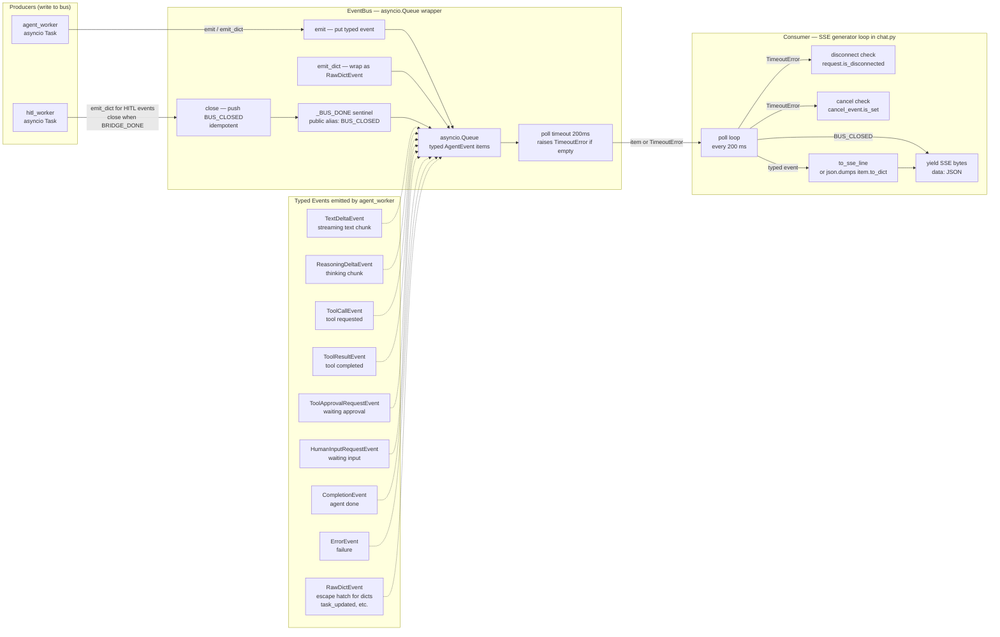
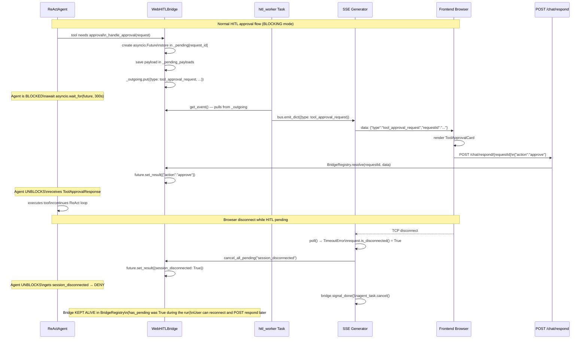
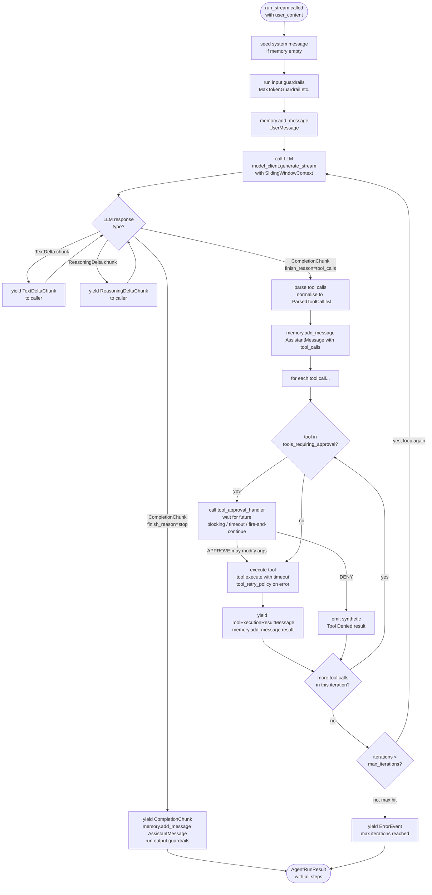
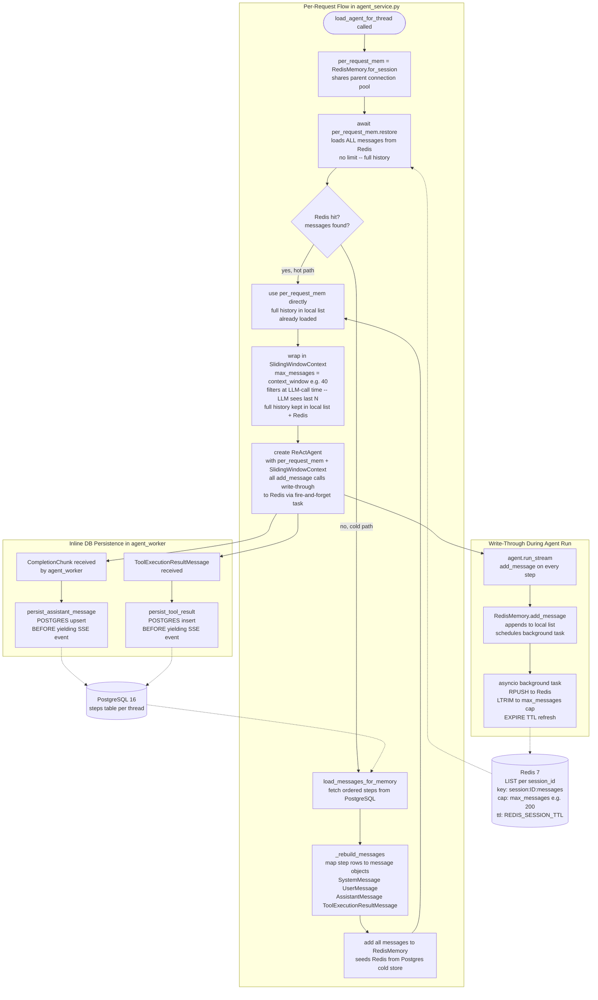
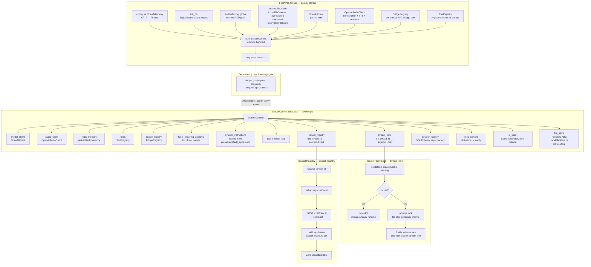
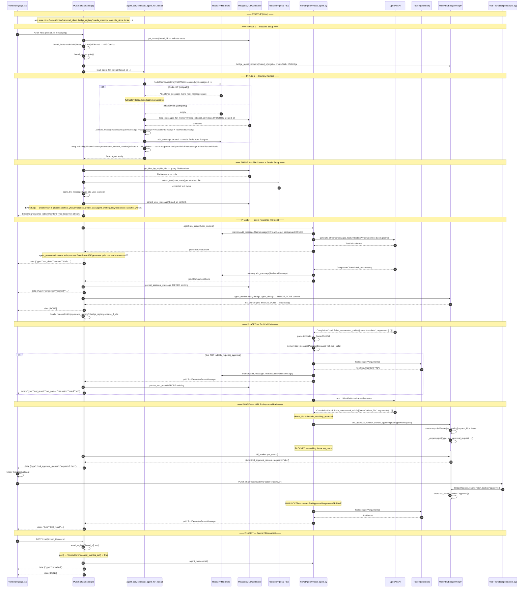
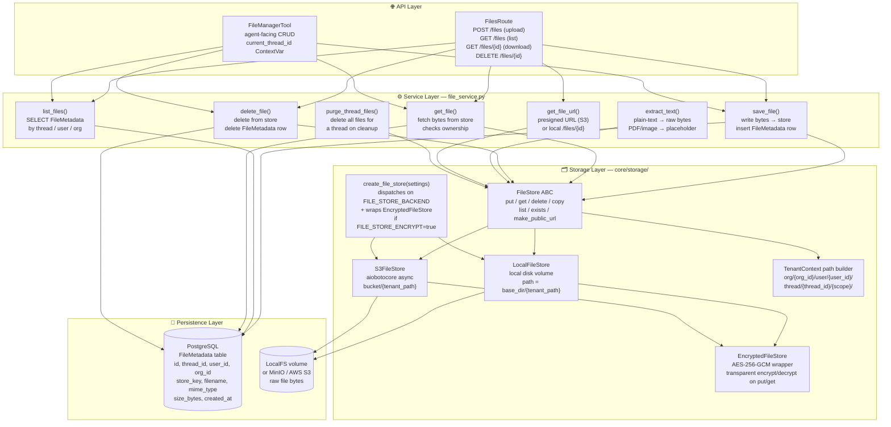

# Agent Framework — Architecture Diagrams

Eight diagrams covering every layer of the system, from individual components to the full end-to-end request flow.

---

## 1. Top-Level Component Map

Shows every module and how they connect. The frontend talks only to FastAPI routes; routes pull all dependencies from `ServerContext` via `Depends(get_ctx)`; the agent uses Redis + Postgres for memory; the LLM is OpenAI.

```mermaid
graph TB
    subgraph Frontend["🖥️ Next.js Frontend (ai-chatbot-ui)"]
        UI[page.tsx\nChat UI]
        SSEClient[EventSource\nSSE Consumer]
        HIC[HumanInputCard]
        TAC[ToolApprovalCard]
        KB[KanbanPanel]
    end

    subgraph FastAPI["⚙️ FastAPI Server (agent-framework)"]
        subgraph Routes["server/routes/"]
            ChatRoute[POST /chat\nchat.py]
            HITLRoute[POST /chat/respond\nhitl.py]
            CancelRoute[POST /chat/cancel\ncancel.py]
            TasksRoute["GET/PATCH /tasks\ntasks.py"]
            ThreadsRoute[threads.py]
            FilesRoute["GET/POST/DELETE /files\nfiles.py"]
        end

        subgraph Context["server/context.py"]
            ServerCtx[ServerContext\nDI Container]
        end

        subgraph Services["server/services/"]
            AgentSvc[agent_service.py\nAgent factory +\nmemory restore]
            FileSvc[file_service.py\nsave / extract / purge]
        end

        subgraph SSE["server/sse/"]
            EB[EventBus\nevents.py]
            HITL[WebHITLBridge\nbridge.py]
            BR[BridgeRegistry\nbridge.py]
        end

        subgraph Agent["core/agents/"]
            ReAct[ReActAgent\nreact_agent.py]
        end

        subgraph Memory["core/memory/"]
            RM[RedisMemory]
            UBM[UnboundedMemory]
            SWC[SlidingWindowContext]
        end

        subgraph FileSystem["core/storage/"]
            FSAbC[FileStore ABC\nbase.py]
            LocalFS[LocalFileStore\nlocal.py]
            S3FS[S3FileStore\ns3.py]
            EncFS[EncryptedFileStore\nencrypted.py]
            TC[TenantContext\ntenant.py]
            FSFact[create_file_store\nfactory.py]
        end

        subgraph Tools["tools/"]
            AHT[AskHumanTool\nHITL input]
            TMT[TaskManagerTool\nKanban board]
            FMT[FileManagerTool\nagent file CRUD]
            BT[BuiltinTools\ncalculator, time, etc.]
            MCP[MCPTools\nexternal integrations]
        end
    end

    subgraph Storage["💾 Storage"]
        Redis[(Redis 7\nHot session store)]
        PG[(PostgreSQL 16\nCold / persistent store\n+ FileMetadata table)]
        ObjStore[(LocalFS volume\nor MinIO / S3\nFile object store)]
    end

    subgraph LLM["🤖 LLM Provider"]
        OAI[OpenAI API\ngpt-4o-mini]
    end

    UI -->|POST /chat| ChatRoute
    SSEClient -->|SSE stream| ChatRoute
    HIC -->|POST /chat/respond| HITLRoute
    TAC -->|POST /chat/respond| HITLRoute
    KB -->|GET /tasks| TasksRoute
    UI -->|POST /files upload| FilesRoute

    ChatRoute -->|Depends get_ctx| ServerCtx
    HITLRoute -->|Depends get_ctx| ServerCtx
    CancelRoute -->|Depends get_ctx| ServerCtx
    FilesRoute -->|Depends get_ctx| ServerCtx

    ServerCtx --> BR
    ServerCtx --> RM
    ServerCtx --> BT
    ServerCtx --> FSAbC

    ChatRoute --> AgentSvc
    AgentSvc --> ReAct
    AgentSvc --> RM

    FilesRoute --> FileSvc
    FileSvc --> FSAbC
    FileSvc --> PG

    ChatRoute --> FileSvc

    FSFact --> LocalFS
    FSFact --> S3FS
    LocalFS & S3FS --> EncFS
    FSAbC --> TC
    LocalFS -.-> ObjStore
    S3FS -.-> ObjStore

    ReAct -->|run_stream| EB
    ReAct --> OAI
    ReAct --> Tools
    ReAct --> FMT

    FMT --> FSAbC
    FMT --> PG

    EB -->|typed events| ChatRoute
    HITL -->|HITL events| ChatRoute

    BR -->|acquire/release| HITL
    HITLRoute -->|resolve| BR

    RM <--> Redis
    AgentSvc <--> PG
```

---

## 2. EventBus — How Events Flow from Agent to SSE

The `EventBus` is a **typed wrapper around `asyncio.Queue`**. Two background tasks write into it:
- `agent_worker` emits strongly-typed events (`TextDeltaEvent`, `CompletionEvent`, etc.)
- `hitl_worker` drains the bridge's outgoing queue and re-emits as `RawDictEvent`

The SSE generator polls the bus every 200 ms. On a `TimeoutError` it checks for browser disconnect or explicit cancel. When `bus.close()` is called it pushes the `BUS_CLOSED` sentinel which tells the consumer to stop.

---

## 3. WebHITLBridge — HITL Approval Sequence

`WebHITLBridge` is a **two-way async channel**. The agent blocks on an `asyncio.Future`. The future's ID is broadcast over SSE to the frontend which shows a UI card. When the user clicks Approve/Deny it POSTs to `/chat/respond/{requestId}` which calls `future.set_result()` to unblock the agent. On disconnect, `cancel_all_pending()` settles all futures immediately so the agent never hangs.

---

## 4. ReActAgent — ReAct Loop Internals

Shows the full Think → Act → Observe loop: LLM generates text/tool calls, each tool either runs directly or goes through the approval handler, results feed back into memory, and the loop repeats until `finish_reason=stop` or `max_iterations` is hit.

---

## 5. Memory System — Redis Hot Path + PostgreSQL Cold Store

On every request, `RedisMemory.restore()` tries Redis first and loads **all** stored messages into the local in-process list. On a miss it reads from Postgres and seeds Redis. During the run, every `add_message()` does a **fire-and-forget background `RPUSH`** to Redis — no blocking writes. `SlidingWindowContext` is the *only* layer that limits history — it selects the last `model_context_window` messages at LLM-call time. Postgres is written synchronously only for `CompletionChunk` and `ToolResultMessage` (inline, before the SSE event is emitted).

---

## 6. ServerContext — DI Container, Locks and Cancel Registry

`ServerContext` is the single DI container assembled at startup. The `thread_locks` dict prevents concurrent streams on the same thread (returns 409). The `cancel_registry` dict maps thread IDs to `asyncio.Event`s; the cancel route sets the event and the poll loop detects it within the next 200 ms poll window.

---

## 7. Complete End-to-End Flow

The full lifecycle of a user message across all 7 phases: request setup → memory restore → file context build → direct text response → tool call → HITL approval → cancel/disconnect.

> **EventBus** is an in-process `asyncio.Queue` — not a network service. It is not shown as a participant; instead the agent_worker emits events to it and the SSE generator polls it, both inside the same process.

---

## 8. File Storage Architecture

Four-zone view of the file storage subsystem: API ingress → service functions → storage abstraction → persistence backends.

