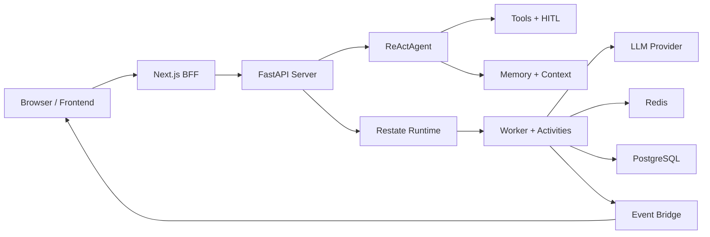

# Diagrams

Use this page when you want the system view before reading implementation details.

## System overview

## Read in this order

1. [Getting Started](../getting-started/index.md) for the first runnable path.
2. [Execution Pipeline](../archive/legacy/execution_pipeline.md) for the detailed sequence view.
3. [Architecture Diagrams](../archive/legacy/ARCHITECTURE_DIAGRAMS.md) for broader component maps.

## Interactive explorer

The previous architecture explorer is preserved here:

- [Legacy interactive explorer](../archive/legacy/architecture_interactive.html)