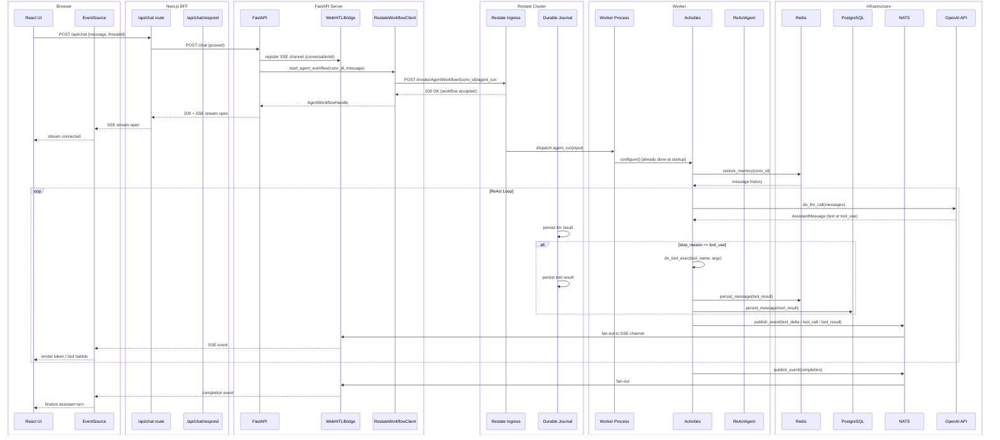
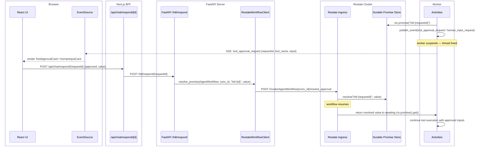
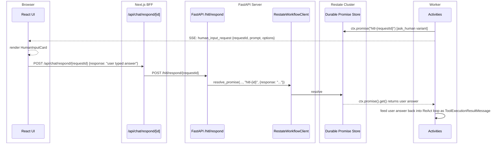
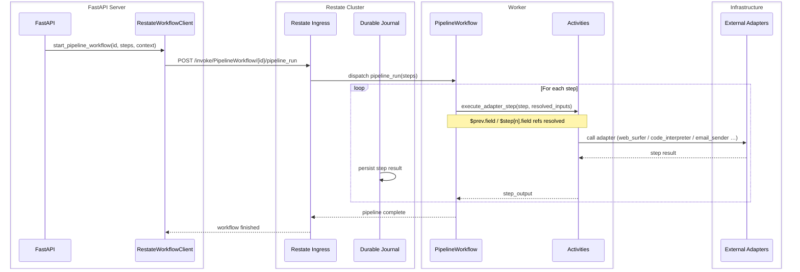
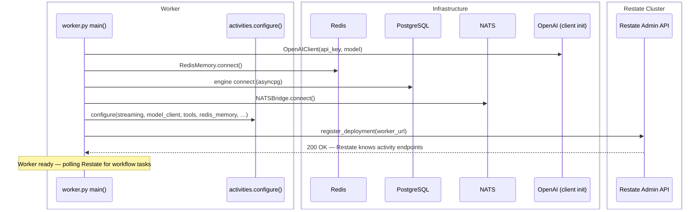

# Execution Pipeline

End-to-end trace of a user message through the Agent Framework — from browser keystroke
to streamed SSE token — with component-level box boundaries.

---

## Component Boundaries

| Box | Components inside |
|---|---|
| **Browser** | React UI (`page.tsx`), EventSource SSE consumer |
| **Next.js BFF** | `app/api/chat/route.ts`, `app/api/chat/respond/[id]/route.ts` |
| **FastAPI Server** | `server/app.py`, `server/routes/chat.py`, `server/routes/workflows.py`, `WebHITLBridge` |
| **Restate Cluster** | Restate ingress (HTTP), durable journal, promise store |
| **Worker** | `integrations/runtime/restate/worker.py`, `activities.py`, `ReActAgent` loop |
| **Infrastructure** | Redis (conversation memory), PostgreSQL (thread/message persistence), NATS (pub/sub fan-out), OpenAI API |

---

## Normal Execution Flow



---

## HITL (Human-In-The-Loop) Approval Flow

Triggered when a tool has `requires_approval=True` or the agent calls `ask_human`.



---

## HITL Human Input Flow

Identical to approval above but triggered by the `ask_human` tool.



---

## Pipeline Workflow Execution



---

## Startup Sequence (Worker)



---

## Key Data Flows Summary

```
User keystroke
  → Next.js BFF (POST /api/chat)
    → FastAPI (register SSE, start workflow)
      → RestateWorkflowClient (HTTP POST to Restate ingress)
        → Restate (persist in journal, dispatch)
          → Worker (run ReAct loop via Activities)
            → Redis  (memory restore/persist)
            → OpenAI (LLM call — result journalled)
            → Tool   (execute — result journalled)
            → PG     (persist message)
            → NATS   (publish SSE event)
              → WebHITLBridge (fan-out)
                → EventSource (Browser SSE stream)
                  → React UI (render token)
```
