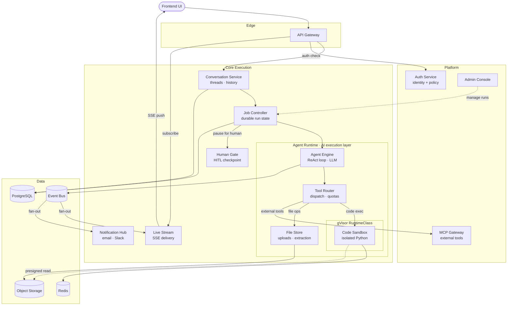

# Microservices Topology and Service Catalog

Status: Draft for approval
Scope: Kubernetes-only, microservice-based target architecture

## 1. Topology Overview


<details><summary>Mermaid fallback (text-based, auto-layout)</summary>



</details>

> **Architecture principles visible in this diagram**
>
> | Concern | How it is addressed |
> |---|---|
> | **Single auth hop** | Auth Service merges Identity + Policy — every request does one auth check before reaching Core |
  | **Clear execution chain** | Conversation Service (history) → Job Controller (durability) → Agent Engine (AI loop) → Tool Router (dispatch) forms an unambiguous top-to-bottom path |
  | **Job Controller owns durability** | Crash recovery, retries, pause/resume, and idempotency live in Job Controller; Agent Engine is stateless between steps |
  | **Human Gate is a checkpoint** | When a run needs human approval, Job Controller suspends to Human Gate; Human Gate resumes the run when the human responds |
> | **Tool Router fans out cleanly** | Code Sandbox (gVisor) for execution, File Store for files, MCP Gateway for external tools — three distinct targets with no overlap |
> | **Sandbox reads directly** | Code Sandbox fetches user files via presigned S3/MinIO URL with no mediator; outputs return through File Store → Object Storage |
> | **Event Bus drives delivery** | Live Stream and Notification Hub are pure consumers of Event Bus — they never call upstream services |
> | **Offline gap filled** | Notification Hub (v2 addition) delivers to email/Slack/webhook when the user is not connected to SSE |

## 2. Service Boundaries

### API Gateway
_Was: Gateway BFF_
- Owns: edge routing, rate limiting, auth token verification (delegates to Auth Service), stream channel fan-out.
- Does not own: business workflow state, tool execution, authorization policy rules.
- Scale pattern: CPU and connection-based HPA.

### Auth Service
_Was: Identity Auth Service + Policy Authorization Service (merged)_
- Owns: user authentication, token/session lifecycle, service account identity, role policy, tenant/workspace authorization checks.
- Does not own: business domain command decisions.
- Why merged: every inbound request requires both identity resolution and policy check in the same call — two round-trips with no benefit at V1.
- Scale pattern: stateless token handlers with low-latency decision cache.

### Conversation Service
_Was: Session Service (v3), Conversation Service (v1)_
- Owns: conversation threads, message records, history query APIs, conversation-level ownership.
- Does not own: run execution state or agent loop logic.
- Scale pattern: read-heavy autoscaling, indexed query store backed by PostgreSQL.

### Job Controller
_Was: Run Manager (v3), Workflow Orchestrator (v1)_
- Owns: durable run state machine, retries, cancellation, pause/resume, idempotency keys, crash recovery checkpoints.
- Does not own: LLM calls or ReAct loop logic — delegates all agent execution to Agent Engine.
- Key distinction from Agent Engine: Job Controller survives a pod crash and can resume from the last checkpoint. Agent Engine cannot.
- Scale pattern: partition by tenant/workspace and run ID.

### Agent Engine
_Was: Agent Runtime Service_
- Owns: the ReAct reasoning loop — calls the LLM, reads the response, decides which tool to call, iterates until done.
- Does not own: durable state between steps. Each step is handed to Job Controller for checkpointing before the next step begins.
- Key distinction from Job Controller: Agent Engine is the AI brain. Job Controller is the supervisor that keeps it alive across failures.
- Scale pattern: queue-driven workers with GPU/CPU concurrency controls.

### Human Gate
_Was: HITL Approval Service_
- Owns: human-in-the-loop checkpoint lifecycle — captures approval requests, stores pending decisions, resumes Run Manager on human response.
- Does not own: model execution or run state.
- Flow: `Job Controller` → `Human Gate` (suspends) → human responds → `Human Gate` → `Job Controller` resumes.
- Scale pattern: event-driven, durable state for reconnect safety.

### Tool Router
_Was: Tool Executor Service_
- Owns: tool dispatch to the right capability (Code Sandbox, File Store, MCP Gateway), per-tool quota and timeout enforcement, result aggregation.
- Does not own: tool implementation — it routes, it does not execute.
- Scale pattern: worker pool by tool class and risk tier.

### Code Sandbox
_Was: CI Session Manager + gVisor Sandbox Pool_
- Owns: stateful sandboxed Python execution per run session, package installation, structured output capture (text, data, files, images).
- Does not own: file persistence — outputs are returned to Tool Router → File Store.
- Runtime: **gVisor (`runtimeClassName: gvisor`)** — isolated user-space kernel, ~5 ms startup, no KVM required.
- Session model: session-affine pod routing (consistent-hash by `session_id`) so Python state (variables, imports, loaded data) persists across agent calls within the same run.
- File reads: presigned S3/MinIO URL → pod fetches directly from Object Storage (no mediator).
- Scale pattern: Deployment with session-affinity HPA on CPU. Redis holds live session→pod bindings.

### File Store
_Was: Artifact Service_
- Owns: file uploads, extraction pipeline (PDF, images, audio), artifact metadata, object storage persistence.
- Does not own: policy decisions or code execution.
- Scale pattern: async jobs for heavy extraction; HPA on queue depth.

### Live Stream
_Was: Stream Projection Service_
- Owns: SSE/WebSocket delivery of live events (text chunks, tool calls, task updates) to the connected browser.
- Does not own: business command handling — it is a pure read-only consumer of Event Bus.
- Scale pattern: connection and event throughput autoscaling.

### Notification Hub
_New in v2 — fills identified gap_
- Owns: async out-of-band delivery when the user is offline — email, Slack, webhook.
- Does not own: SSE streaming (that is Live Stream's job).
- Trigger: subscribes to `run.completed` / `run.failed` / `hitl.pending` events from Event Bus.
- Scale pattern: event-driven workers, low steady-state load.

### MCP Gateway
_Was: MCP Registry Gateway_
- Owns: MCP app/tool registration, capability metadata, routing to external MCP servers.
- Does not own: tenant policy decisions.
- Scale pattern: registry cache + integration health polling.

### Admin Console
_Was: Admin Control Plane_
- Owns: operator APIs (drain, kill, diagnostics), tenant administration, runtime controls.
- Does not own: direct execution path for user chat.
- Scale pattern: low traffic, high security hardening.

## 3. Synchronous and Asynchronous Paths

### Sync (request/response)
- Frontend → API Gateway → Auth Service (every request)
- API Gateway → Conversation Service (create thread, load history)
- API Gateway → Live Stream (SSE subscription setup)
- Admin UI → Admin Console

### Async (event-driven)
- Conversation Service command → Job Controller enqueue
- Job Controller → Agent Engine via work queue
- Agent Engine → Event Bus (step completed, tool called, text chunk)
- Event Bus → Live Stream (fan-out, browser delivery)
- Event Bus → Notification Hub (fan-out, offline delivery)
- Human Gate request/response via Event Bus
- Tool Router dispatches are async internally (queue per tool class)

## 4. First Approval Checklist

1. Confirm all 13 listed services are in scope for V1 platform topology.
2. Confirm API Gateway remains thin — no orchestration logic.
3. Confirm Auth Service merger (Identity + Policy) is acceptable; split if compliance requires separate deployments.
4. Confirm Job Controller is the durable source of truth for all long-running runs.
5. Confirm Agent Engine is stateless between steps — all state checkpointed by Job Controller.
6. Confirm Live Stream is a pure Event Bus consumer — no business command handling.
7. Confirm Notification Hub is in scope for V1 or explicitly deferred to V2.
8. Confirm Code Sandbox uses gVisor runtime (not Firecracker) — see §5.
9. Confirm data storage ownership in this doc aligns with governance requirements.

## 5. Sandbox Runtime Decision: gVisor vs Firecracker vs Kata

### Requirements
| Requirement | Description |
|---|---|
| **Sandboxed execution** | Agent-generated code must not be able to escape to host or affect other tenants |
| **Stateful sessions** | Same session reuses the same interpreter — variables, imports, loaded data persist between agent calls |
| **Object storage access** | Code can read/write files in MinIO/S3 (user thread-scoped files) |
| **K8s native** | Must run in normal K8s pods without custom hardware requirements |

### Option Comparison

| Criterion | **gVisor** ✅ Chosen | Firecracker | Kata Containers |
|---|---|---|---|
| **Isolation mechanism** | User-space kernel (Sentry intercepts all syscalls) | Full separate microVM per session via KVM | Lightweight VM per pod (QEMU or Firecracker hypervisor) |
| **Startup latency** | ~5ms (container speed) | ~125ms cold VM boot | ~500ms–2s (QEMU) / ~150ms (FC hypervisor) |
| **Session statefulness** | ✅ Python pod stays alive, process is persistent between calls | ✅ microVM process persists per session | ✅ pod persists |
| **KVM / bare-metal required** | ❌ No — works on any node | ✅ Yes — `/dev/kvm`, nodeSelector, privileged | ✅ Usually yes |
| **K8s deployment type** | Deployment + `runtimeClassName: gvisor` | StatefulSet (in-process VMPool can't share across workers) | Deployment + `runtimeClassName: kata-containers` |
| **Node provisioning** | DaemonSet to install gVisor binary only | DaemonSet to provisio kernel `.bin` + `rootfs.ext4` + modprobe vhost_vsock | Less setup (Kata bundles its own guest kernel) |
| **Object storage access** | ✅ Normal Python HTTP (boto3 / urllib) through gVisor net stack | ✅ VM has network, but VSock I/O adds complexity for object storage | ✅ Normal container networking |
| **CPU perf for compute** | ✅ Near-native (no instruction emulation) | ✅ Native in VM | ✅ Native in VM |
| **Syscall overhead** | ~5-10x for heavy-syscall workloads; negligible for compute-heavy code | None beyond vsock roundtrip | Minimal |
| **Operational complexity** | Low — just a RuntimeClass and DaemonSet | High — StatefulSet, KVM nodes, rootfs builds, node taint management | Medium |
| **Security level** | High — no syscall passes through to host kernel | Very high — separate kernel | High — VM boundary |

### Recommendation: gVisor

For **AI agent code execution** with stateful sessions, gVisor is the right fit:

1. **Statefulness is trivial**: a gVisor pod is just a container. The Python process runs for the lifetime of the session pod. No VMPool, no vsock, no warm pool management needed.

2. **Object storage access is native**: the sandboxed process calls `boto3.client('s3').download_file(...)` or `urllib.request.urlretrieve(presigned_url, '/tmp/data.csv')` — normal Python HTTP through gVisor's network stack. No special bridging needed for reads. Writes go via Tool Executor → Artifact Service.

3. **No specialized hardware**: any K8s node can run gVisor pods. No `nodeSelector: {firecracker: "true"}`, no `/dev/kvm` hostPath volumes, no rootfs/kernel asset management.

4. **CPU-intensive code is near-native**: numpy, pandas, matplotlib, sklearn — these are CPU-bound. gVisor adds zero overhead to raw CPU execution. Only syscall-heavy patterns (high-frequency small I/O) are slower, which is atypical for analytical code.

5. **Simpler architecture**: drop StatefulSet, VMPool, SessionManager, vsock protocol, and guest agent complexity. Replace with: Deployment + `runtimeClassName: gvisor` + session-affinity routing.

### When Firecracker would be preferred
- Public-facing code playground open to arbitrary untrusted users (full kernel isolation is critical)
- Regulatory compliance requiring hypervisor-level tenant separation (e.g., PCI-DSS, FedRAMP)
- Workloads that need to run arbitrary OS-level operations (kernel modules, raw socket manipulation)

### gVisor K8s Setup (summary)
```
# 1. Install gVisor on nodes (DaemonSet)
#    https://gvisor.dev/docs/user_guide/containerd/
# 2. Create RuntimeClass
apiVersion: node.k8s.io/v1
kind: RuntimeClass
metadata:
  name: gvisor
handler: runsc
---
# 3. Code Interpreter pod spec
spec:
  runtimeClassName: gvisor
  containers:
  - name: code-interpreter
    image: code-interpreter:latest
    # No --workers 1 constraint — process is stateful but in the pod, not VMPool
    # Session affinity on Service routes same session_id to same pod
```

