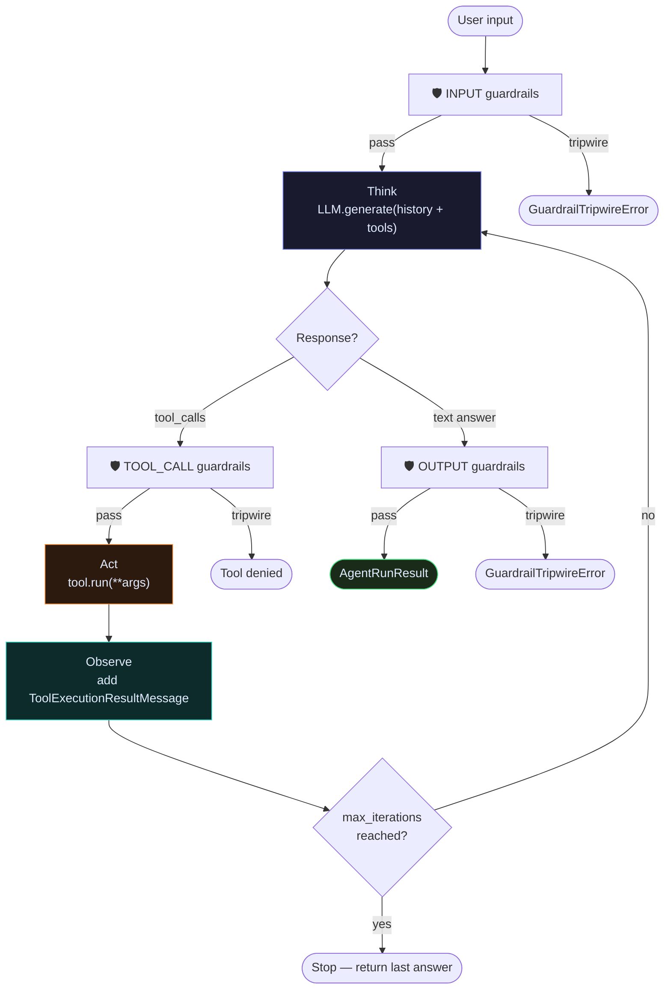
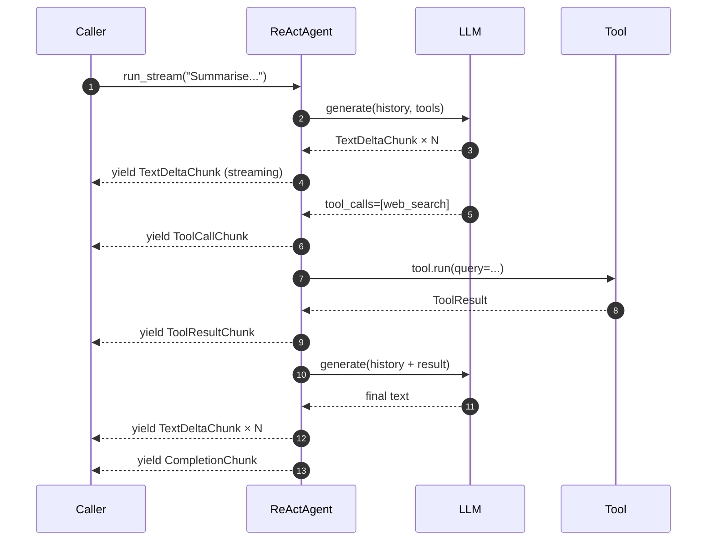
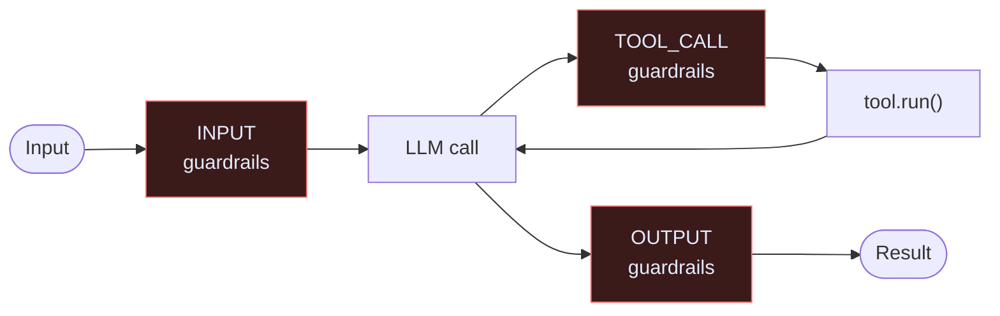

# Agents

Every agent in Raavan follows the same loop: **Think → Act → Observe**.

Think: call the LLM with history + tool schemas. Act: execute the tool(s) the LLM picked. Observe: add the result back to history. Repeat until the LLM produces a final text answer or `max_iterations` is reached.

---

## The ReAct loop



---

## BaseAgent

All agents share the same construction contract. `ReActAgent` is the concrete implementation you use in practice.

```python
from raavan.core.agents.react_agent import ReActAgent
from raavan.core.context.implementations import SlidingWindowContext
from raavan.integrations.llm.openai.openai_client import OpenAIClient

client = OpenAIClient(model="gpt-4o")

agent = ReActAgent(
    name="researcher",
    description="Web research agent",
    model_client=client,
    model_context=SlidingWindowContext(max_messages=20),
    tools=[WebSearchTool(), CodeInterpreterTool()],
    system_instructions="You are a precise research assistant.",
    max_iterations=10,
    tool_timeout=30.0,      # seconds per tool call
    run_timeout=120.0,      # total wall-clock budget
)
```

### Key constructor parameters

| Parameter | Type | Default | Purpose |
|---|---|---|---|
| `model_client` | `BaseModelClient` | required | LLM backend |
| `model_context` | `ModelContext` | required | Which messages to send the LLM |
| `tools` | `list[BaseTool]` | `[]` | Tools the agent can call |
| `memory` | `BaseMemory` | `None` | Where conversation history is stored |
| `max_iterations` | `int` | `50` | Guard against infinite loops |
| `tool_timeout` | `float` | `30.0` | Per-tool execution timeout (seconds) |
| `run_timeout` | `float` | `None` | Total run budget (seconds) |
| `input_guardrails` | `list` | `[]` | Guards before first LLM call |
| `output_guardrails` | `list` | `[]` | Guards before returning to user |

---

## Running an agent

### Blocking — wait for the full answer

```python
from raavan.core.agents.react_agent import ReActAgent

result = await agent.run("What is the current Python version?")

print(result.output)          # final text
print(result.status)          # RunStatus.COMPLETED
print(result.tool_calls)      # list of tools called
print(result.usage)           # token usage
```

### Streaming — receive output as it arrives

The agent yields typed `StreamChunk` objects. Process only what you need.

```python
from raavan.core.messages import TextDeltaChunk, CompletionChunk

async for chunk in agent.run_stream("Summarise the AI news"):
    if isinstance(chunk, TextDeltaChunk):
        print(chunk.text, end="", flush=True)
    elif isinstance(chunk, CompletionChunk):
        final = chunk.message
        break
```



---

## Guardrail injection points

Three gates protect every turn. Each returns a `GuardrailResult` with `passed`, `tripwire`, and `message`. A `tripwire=True` result raises `GuardrailTripwireError` immediately, stopping the run.



```python
from raavan.core.guardrails.prebuilt import (
    PromptInjectionGuardrail,
    PIIDetectionGuardrail,
    ContentFilterGuardrail,
)
from raavan.core.guardrails.base_guardrail import GuardrailType

agent = ReActAgent(
    ...
    input_guardrails=[
        PromptInjectionGuardrail(tripwire=True),
        PIIDetectionGuardrail(pii_types=["email", "credit_card"]),
    ],
    output_guardrails=[
        ContentFilterGuardrail(
            guardrail_type=GuardrailType.OUTPUT,
            blocked_keywords=["internal_system_name"],
        ),
    ],
)
```

See the full list of prebuilt guards → [Guardrails](../guardrails/index.md)

---

## Reset between sessions

```python
await agent.reset()   # clears memory, re-seeds system message, resets counters
```

---

## Source

| File | What it owns |
|---|---|
| [`core/agents/base_agent.py`](https://github.com/Ravikumarchavva/raavan/blob/main/src/raavan/core/agents/base_agent.py) | `BaseAgent` ABC, `PromptEnricher` protocol |
| [`core/agents/react_agent.py`](https://github.com/Ravikumarchavva/raavan/blob/main/src/raavan/core/agents/react_agent.py) | `ReActAgent` — full Think→Act→Observe loop |
| [`core/agents/orchestrator_agent.py`](https://github.com/Ravikumarchavva/raavan/blob/main/src/raavan/core/agents/orchestrator_agent.py) | `OrchestratorAgent` — delegates to sub-agents |
| [`core/agents/flow.py`](https://github.com/Ravikumarchavva/raavan/blob/main/src/raavan/core/agents/flow.py) | `FlowAgent` — graph-based multi-step flows |
| [`core/agents/agent_result.py`](https://github.com/Ravikumarchavva/raavan/blob/main/src/raavan/core/agents/agent_result.py) | `AgentRunResult`, `RunStatus` |
