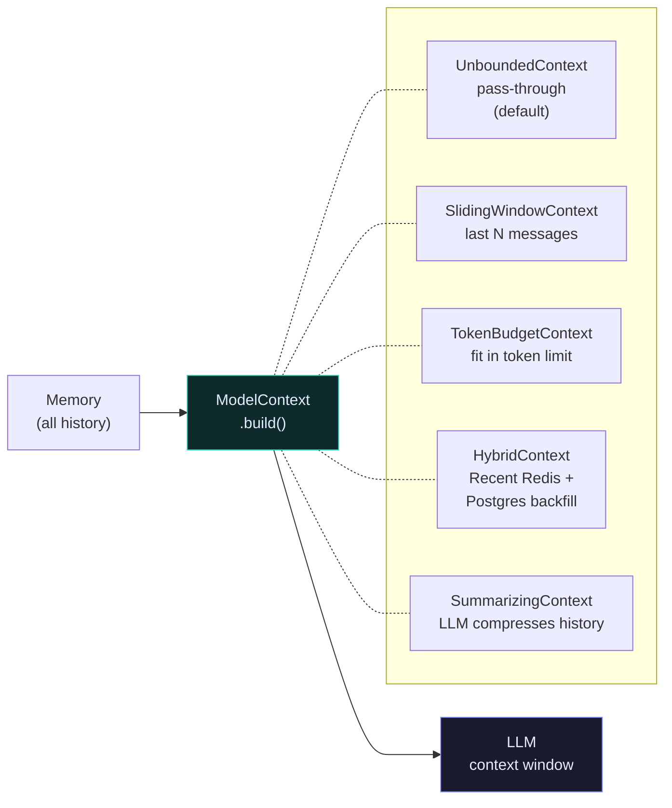
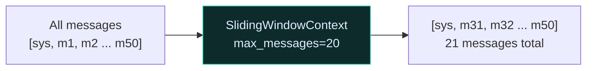
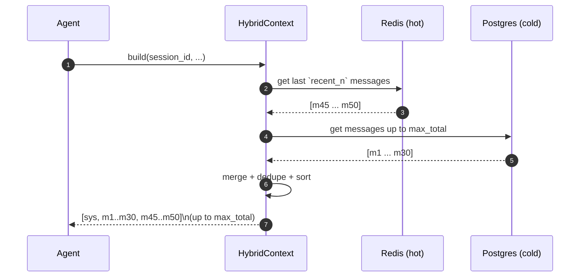
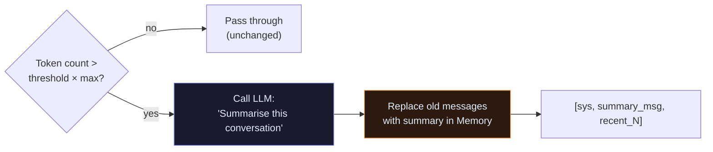

# Context

Context is what you filter memory down to before handing it to the LLM.

An agent may have 10,000 messages in memory. The LLM has a context window. `ModelContext` is the strategy that decides which messages the LLM actually sees on each turn.

---

## The pipeline



---

## Strategies at a glance

| Strategy | What it keeps | Best for |
|---|---|---|
| `UnboundedContext` | Everything | Scripts, tests, short sessions |
| `SlidingWindowContext` | `SystemMessage` + last N | Chatbots with medium sessions |
| `TokenBudgetContext` | As many messages as fit | When you know the model's token limit |
| `HybridContext` | Redis recent + Postgres backfill | Long-running production sessions |
| `SummarizingContext` | Compressed summary + recent | Very long sessions with LLM-friendly summaries |

---

## UnboundedContext

Pass-through. Every message in memory is sent to the LLM unchanged. The `SystemMessage` at index 0 is always preserved.

```python
from raavan.core.context.implementations import UnboundedContext

ctx = UnboundedContext()   # default — no arguments
```

**Use when:** session is short (< 20 messages) or you're prototyping.

---

## SlidingWindowContext

Keeps `SystemMessage` + the **last `max_messages`** non-system messages. Oldest messages are silently dropped.

```python
from raavan.core.context.implementations import SlidingWindowContext

ctx = SlidingWindowContext(max_messages=20)
```



**Use when:** you want a simple, predictable window and don't care about token counting.

---

## TokenBudgetContext

Drops the oldest non-system messages until total token count is under `max_tokens`. Uses `model_client.count_tokens()` if provided, else falls back to the 4-chars-per-token heuristic.

```python
from raavan.core.context.implementations import TokenBudgetContext

ctx = TokenBudgetContext(max_tokens=8_000)

# For accurate token counting, pass the model client
ctx = TokenBudgetContext(max_tokens=8_000)
# model_client is passed in at build() time by the agent
```

**Use when:** you know your model's context window and want to maximise usage without ever overflowing.

---

## HybridContext

Fuses two sources: Redis (fast, recent messages) and Postgres (full history backfill). Deduplicates by content.



```python
from raavan.core.context.implementations import HybridContext

ctx = HybridContext(
    session_manager=sm,
    recent_n=20,       # always include last 20 from Redis
    max_total=40,      # backfill from Postgres up to 40 total
)
# Constraint: recent_n ≤ max_total
```

**Use when:** sessions outlive a single worker process and you need both speed (Redis) and completeness (Postgres).

---

## SummarizingContext

When history exceeds `threshold × model_max_tokens`, calls the LLM to produce a summary message, then replaces old messages with that summary in the backing `Memory`.



```python
from raavan.core.context.implementations import SummarizingContext

ctx = SummarizingContext(
    model_client=client,
    threshold=0.8,    # compress when at 80% of context window
)
```

**Use when:** sessions are very long and you want the agent to maintain a coherent view of early history without blowing the token budget.

---

## Source

| File | What it owns |
|---|---|
| [`core/context/base_context.py`](https://github.com/Ravikumarchavva/raavan/blob/main/src/raavan/core/context/base_context.py) | `ModelContext` ABC |
| [`core/context/implementations.py`](https://github.com/Ravikumarchavva/raavan/blob/main/src/raavan/core/context/implementations.py) | All five context strategies |
