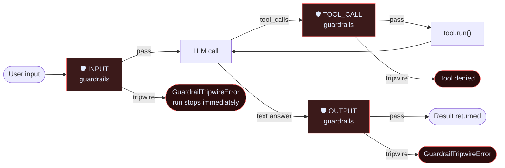
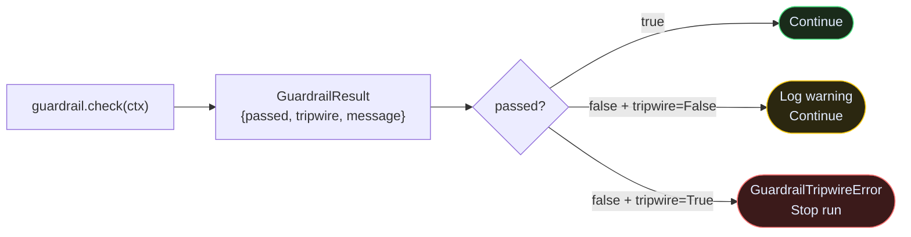
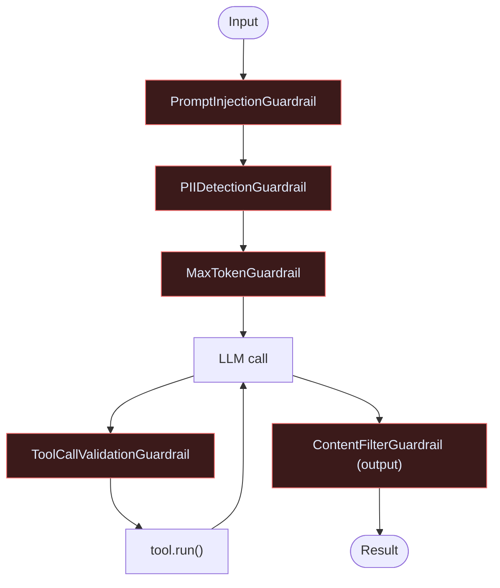

# Guardrails

Guardrails are checks that fire at three points in every agent turn. They protect against prompt injection, PII leakage, runaway tool calls, and toxic output — before any damage is done.

---

## Three injection points



---

## pass / fail / tripwire

Every guardrail returns a `GuardrailResult`. The `tripwire` field is the danger switch.



---

## Prebuilt guardrails

### PromptInjectionGuardrail

Blocks 13 patterns: DAN prompts, role-override attempts, jailbreaks, "ignore previous instructions", etc.

```python
from raavan.core.guardrails.prebuilt import PromptInjectionGuardrail

guard = PromptInjectionGuardrail(
    tripwire=True,               # raise on detection
    extra_patterns=["my_org_secret"],   # add your own regex patterns
)
```

### PIIDetectionGuardrail

Detects email, US phone, SSN, credit card, and IP address by default. `pii_types=None` activates all patterns.

```python
from raavan.core.guardrails.prebuilt import PIIDetectionGuardrail

guard = PIIDetectionGuardrail(
    pii_types=["email", "credit_card"],  # None = all
    custom_patterns={"employee_id": r"EMP-\d{6}"},
    tripwire=True,
)
```

### ContentFilterGuardrail

Blocks messages matching regex patterns or keyword lists. Works at INPUT or OUTPUT.

```python
from raavan.core.guardrails.prebuilt import ContentFilterGuardrail
from raavan.core.guardrails.base_guardrail import GuardrailType

# As output filter
guard = ContentFilterGuardrail(
    guardrail_type=GuardrailType.OUTPUT,
    blocked_keywords=["internal_project_name", "api_key_here"],
    blocked_patterns=[r"sk-[A-Za-z0-9]{48}"],  # OpenAI key pattern
    tripwire=True,
)
```

### MaxTokenGuardrail

Rejects input that's too long before it ever reaches the LLM. Uses `tiktoken` when available.

```python
from raavan.core.guardrails.prebuilt import MaxTokenGuardrail

guard = MaxTokenGuardrail(
    max_tokens=4096,
    model="gpt-4o",
    tripwire=True,
)
```

### ToolCallValidationGuardrail

Checks which tools the LLM is allowed to call and validates argument patterns before execution.

```python
from raavan.core.guardrails.prebuilt import ToolCallValidationGuardrail

guard = ToolCallValidationGuardrail(
    allowed_tools=["web_search", "code_interpreter"],  # None = all allowed
    blocked_tools=["delete_file"],
    blocked_argument_patterns={
        "run_sql": {
            "query": [r"DROP\s+TABLE", r"DELETE\s+FROM"],  # block destructive SQL
        },
    },
    tripwire=True,
)
```

### LLMJudgeGuardrail

Uses a second LLM call to evaluate the content. The judge must respond with `{"safe": bool, "reason": str}`.

```python
from raavan.core.guardrails.prebuilt import LLMJudgeGuardrail
from raavan.core.guardrails.base_guardrail import GuardrailType

guard = LLMJudgeGuardrail(
    model_client=client,
    judge_prompt="Is this response safe, factual, and non-toxic? Respond with {\"safe\": bool, \"reason\": str}",
    guardrail_type=GuardrailType.OUTPUT,
    tripwire=True,
)
```

---

## Full example — hardened agent



```python
from raavan.core.agents.react_agent import ReActAgent
from raavan.core.guardrails.prebuilt import (
    PromptInjectionGuardrail,
    PIIDetectionGuardrail,
    MaxTokenGuardrail,
    ToolCallValidationGuardrail,
    ContentFilterGuardrail,
)
from raavan.core.guardrails.base_guardrail import GuardrailType

agent = ReActAgent(
    name="safe_agent",
    model_client=client,
    model_context=ctx,
    tools=[WebSearchTool(), CodeInterpreterTool()],
    input_guardrails=[
        PromptInjectionGuardrail(tripwire=True),
        PIIDetectionGuardrail(pii_types=["email", "ssn", "credit_card"]),
        MaxTokenGuardrail(max_tokens=4096),
    ],
    output_guardrails=[
        ContentFilterGuardrail(
            guardrail_type=GuardrailType.OUTPUT,
            blocked_patterns=[r"sk-[A-Za-z0-9]{48}"],
        ),
    ],
    # TOOL_CALL guardrails go inside ReActAgent via tools_requiring_approval
    # or use ToolCallValidationGuardrail via a custom config
)
```

---

## Writing a custom guardrail

Subclass `BaseGuardrail`, set `name` and `guardrail_type` at the class level, implement `check()`.

```python
from raavan.core.guardrails.base_guardrail import (
    BaseGuardrail, GuardrailContext, GuardrailResult, GuardrailType
)

class LengthGuardrail(BaseGuardrail):
    name           = "length_check"
    guardrail_type = GuardrailType.INPUT

    def __init__(self, max_chars: int = 2000, tripwire: bool = True):
        self.max_chars = max_chars
        self.tripwire  = tripwire

    async def check(self, ctx: GuardrailContext) -> GuardrailResult:
        text = ctx.input_text or ""
        if len(text) > self.max_chars:
            return self._fail(
                f"Input too long: {len(text)} chars (max {self.max_chars})",
                tripwire=self.tripwire,
                length=len(text),
            )
        return self._pass()
```

---

## Source

| File | What it owns |
|---|---|
| [`core/guardrails/base_guardrail.py`](https://github.com/Ravikumarchavva/raavan/blob/main/src/raavan/core/guardrails/base_guardrail.py) | `BaseGuardrail`, `GuardrailContext`, `GuardrailResult`, `GuardrailType` |
| [`core/guardrails/prebuilt.py`](https://github.com/Ravikumarchavva/raavan/blob/main/src/raavan/core/guardrails/prebuilt.py) | All five prebuilt guardrails |
| [`core/guardrails/runner.py`](https://github.com/Ravikumarchavva/raavan/blob/main/src/raavan/core/guardrails/runner.py) | Guardrail pipeline runner (used by agents internally) |
