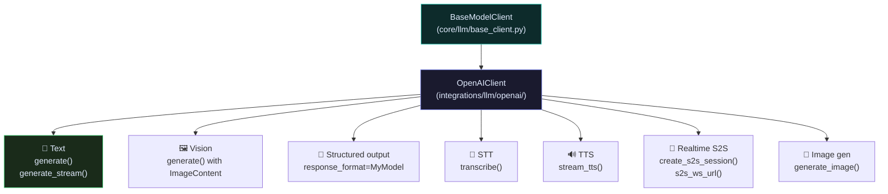
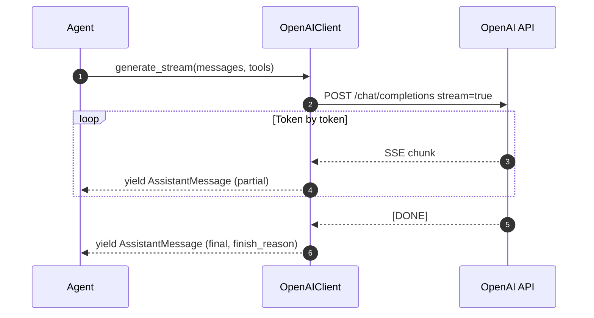

# LLM Client

One abstract base, one concrete implementation, multiple modalities.

`BaseModelClient` defines the contract. `OpenAIClient` implements it — handling text generation, vision, structured output, streaming, speech-to-text, text-to-speech, real-time S2S, and image generation from a single class.

---

## Modality map



---

## Import paths

```python
# Abstract base (no external deps — safe to import anywhere)
from raavan.core.llm.base_client import BaseModelClient

# Concrete implementation
from raavan.integrations.llm.openai.openai_client import OpenAIClient
```

---

## Text generation

### Blocking

```python
from raavan.integrations.llm.openai.openai_client import OpenAIClient
from raavan.core.messages import SystemMessage, UserMessage

client = OpenAIClient(model="gpt-4o", temperature=0.7)

messages = [
    SystemMessage("You are a helpful assistant."),
    UserMessage(content=["What is the capital of France?"]),
]

response = await client.generate(messages)
print(response.content[0].text)   # "Paris"
print(response.usage)             # {prompt_tokens, completion_tokens, total_tokens}
```

### Streaming



```python
async for partial in client.generate_stream(messages):
    if partial.content:
        print(partial.content[0].text, end="", flush=True)
```

---

## Capability checks

Audio and image methods are optional. Always check the property before calling.

```python
# Audio
if client.supports_audio:
    transcript = await client.transcribe(
        audio_bytes=audio_data,
        filename="meeting.mp3",
        model="gpt-4o-transcribe",
        language="en",
    )

    async for chunk in client.stream_tts(
        text="Hello world",
        voice="coral",         # alloy echo fable nova onyx sage shimmer
        model="tts-1",
        response_format="mp3",
    ):
        audio_buffer.write(chunk)

# Real-time speech-to-speech
if client.supports_s2s:
    ws_url = client.s2s_ws_url(model="gpt-4o-realtime-preview")
    session = await client.create_s2s_session(
        model="gpt-4o-realtime-preview",
        voice="coral",
        instructions="You are a voice assistant.",
    )

# Image generation
if client.supports_image_generation:
    urls = await client.generate_image(
        "a cat in a spacesuit, realistic",
        model="gpt-image-1",
        size="1024x1024",
        quality="high",    # low / medium / high / auto
    )
    # Returns list[str] — URLs or data:image/png;base64,... strings
```

---

## Structured output

Pass a Pydantic model as `response_format` and the LLM is forced to return valid JSON matching your schema.

```python
from pydantic import BaseModel

class Analysis(BaseModel):
    sentiment: str
    confidence: float
    summary: str

response = await client.generate(
    messages,
    response_format=Analysis,
)

result = response.parsed       # Analysis instance, or None if parse failed
if result:
    print(result.sentiment, result.confidence)
```

---

## Vision input

Pass `ImageContent` objects in a `UserMessage` to feed images to the LLM.

```python
from raavan.core.messages import UserMessage, ImageContent

msg = UserMessage(content=[
    "Describe what you see in this image.",
    ImageContent(url="https://example.com/photo.jpg", detail="high"),
])

# From bytes (no network fetch)
msg = UserMessage(content=[
    ImageContent(data=open("chart.png", "rb").read(), media_type="image/png"),
])

# From OpenAI Files API
msg = UserMessage(content=[
    ImageContent(file_id="file-abc123"),
])
```

`detail` values: `"low"` · `"high"` · `"original"` · `"auto"` (default)

---

## Token counting

```python
count = await client.count_tokens(messages)
# Used by TokenBudgetContext to fit messages in the context window
```

---

## Source

| File | What it owns |
|---|---|
| [`core/llm/base_client.py`](https://github.com/Ravikumarchavva/raavan/blob/main/src/raavan/core/llm/base_client.py) | `BaseModelClient` ABC — text, audio, image generation signatures |
| [`integrations/llm/openai/openai_client.py`](https://github.com/Ravikumarchavva/raavan/blob/main/src/raavan/integrations/llm/openai/openai_client.py) | `OpenAIClient` — all modalities |
