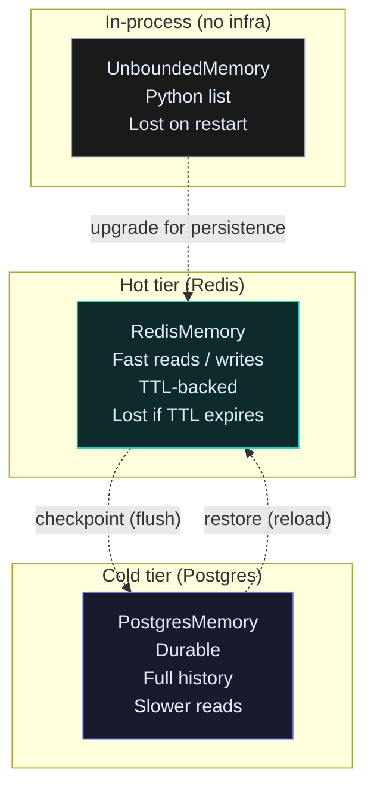
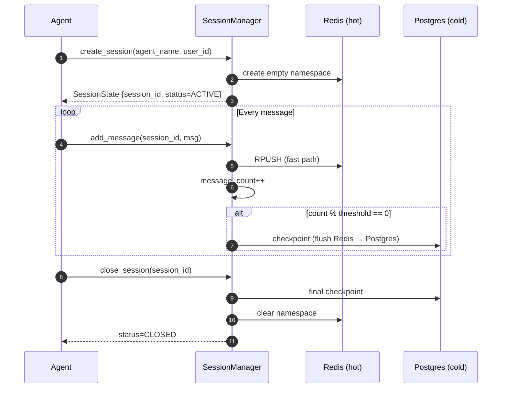
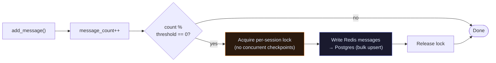

# Memory

Memory is where an agent stores and retrieves its conversation history.

There are three tiers — pick the one that fits your durability needs. All implement the same `BaseMemory` interface, so you can swap them without changing agent code.

---

## The three tiers



---

## UnboundedMemory — in-process

The simplest choice: a Python list in RAM. Returns instantly. Use it for scripts, notebooks, and unit tests where crash recovery is not needed.

```python
from raavan.core.memory.unbounded_memory import UnboundedMemory
from raavan.core.messages import SystemMessage, UserMessage

mem = UnboundedMemory()

await mem.add_message(SystemMessage("You are a helpful assistant."))
await mem.add_message(UserMessage(content=["Hello!"]))

msgs  = await mem.get_messages()        # all messages
msgs5 = await mem.get_messages(limit=5) # last 5 only
count = await mem.size()
tokens = await mem.get_token_count()    # heuristic: 4 chars ≈ 1 token

await mem.clear()
```

---

## RedisMemory — hot tier

Conversation history lives in Redis with a TTL. Survives process restarts as long as the TTL has not expired. All methods are async — always `await` them.

```python
from raavan.integrations.memory.redis_memory import RedisMemory

mem = RedisMemory(
    session_id="conv-abc-123",
    redis_url="redis://localhost:6379",
)

# Lifecycle: connect → use → disconnect  (no close() method)
await mem.connect()
await mem.restore()           # reload existing history from Redis

await mem.add_message(msg)
msgs = await mem.get_messages()

await mem.disconnect()        # ← correct; there is no close()
```

> **Critical rules:**
> All `Memory` methods are `async def`. Always `await` them.
> Lifecycle is `connect()` → use → `disconnect()`. There is no `close()` method.

---

## SessionManager — two-tier lifecycle

`SessionManager` manages a Redis hot tier and a Postgres cold tier together. It auto-checkpoints (flushes Redis → Postgres) when message count crosses a threshold.



```python
from raavan.core.memory.session_manager import SessionManager
from raavan.integrations.memory.redis_memory import RedisMemory
from raavan.integrations.memory.postgres_memory import PostgresMemory

sm = SessionManager(
    redis=RedisMemory(session_id="mgr", redis_url=REDIS_URL),
    postgres=PostgresMemory(session_id="mgr", db_url=DATABASE_URL),
    auto_checkpoint_threshold=50,   # flush every 50 messages
)
await sm.connect()

# Create
state = await sm.create_session(agent_name="researcher", user_id="user-1")

# Add messages
await sm.add_message(state.session_id, user_msg)

# Retrieve (Redis if hot, else Postgres fallback)
msgs = await sm.get_messages(state.session_id)

# Resume a session after restart
state = await sm.resume_session(session_id)   # raises ValueError if missing

# Close (final checkpoint + clear Redis)
await sm.close_session(state.session_id)

await sm.disconnect()
```

### Checkpoint flow



---

## Source

| File | What it owns |
|---|---|
| [`core/memory/base_memory.py`](https://github.com/Ravikumarchavva/raavan/blob/main/src/raavan/core/memory/base_memory.py) | `BaseMemory` ABC |
| [`core/memory/unbounded_memory.py`](https://github.com/Ravikumarchavva/raavan/blob/main/src/raavan/core/memory/unbounded_memory.py) | `UnboundedMemory` — in-process list |
| [`core/memory/session_manager.py`](https://github.com/Ravikumarchavva/raavan/blob/main/src/raavan/core/memory/session_manager.py) | `SessionManager`, `SessionState`, `SessionStatus` |
| [`integrations/memory/redis_memory.py`](https://github.com/Ravikumarchavva/raavan/blob/main/src/raavan/integrations/memory/redis_memory.py) | `RedisMemory` — hot tier |
| [`integrations/memory/postgres_memory.py`](https://github.com/Ravikumarchavva/raavan/blob/main/src/raavan/integrations/memory/postgres_memory.py) | `PostgresMemory` — cold tier |
