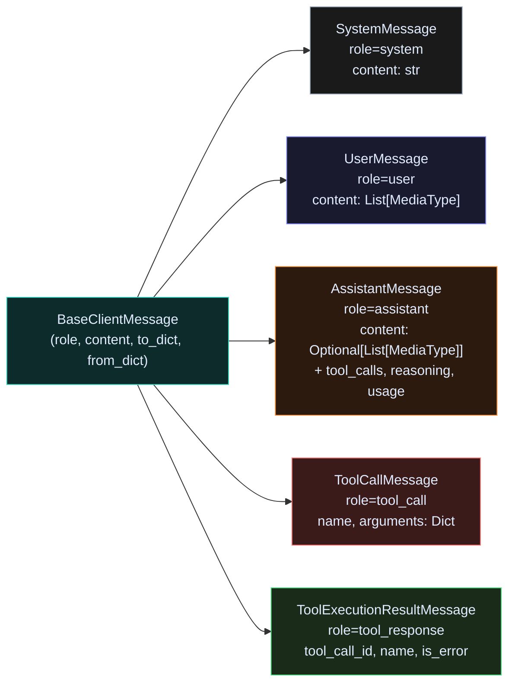
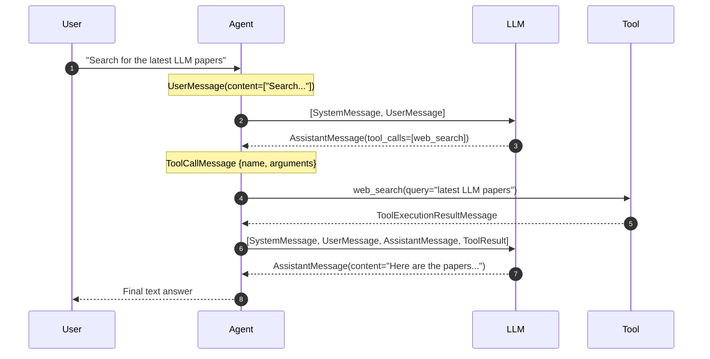
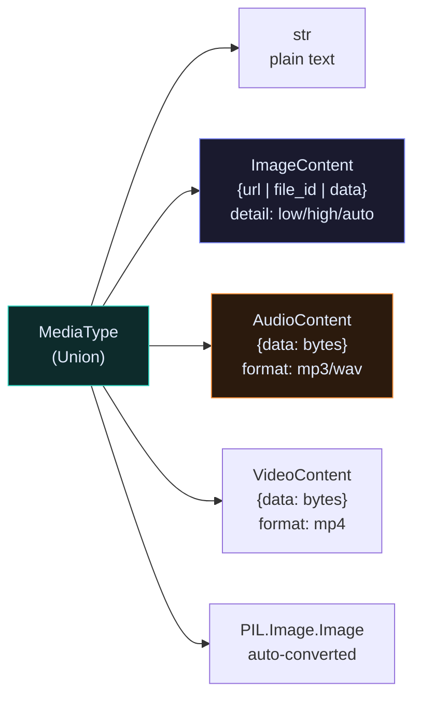

# Messages

Every interaction in Raavan is a typed message. Messages form the conversation history that the LLM sees, the tool calls it makes, and the results it receives back.

---

## Message type hierarchy



---

## A conversation turn



---

## Message types in code

### SystemMessage

```python
from raavan.core.messages import SystemMessage

msg = SystemMessage("You are a precise research assistant.")
# content is a plain string
```

### UserMessage — text and multi-modal

```python
from raavan.core.messages import UserMessage, ImageContent, AudioContent

# Text only
msg = UserMessage(content=["What year is it?"])

# Text + image URL
msg = UserMessage(content=[
    "What is this chart showing?",
    ImageContent(url="https://example.com/chart.png", detail="high"),
])

# Image from bytes (no URL needed)
msg = UserMessage(content=[
    ImageContent(data=open("photo.jpg", "rb").read(), media_type="image/jpeg"),
])

# Image from Files API
msg = UserMessage(content=[ImageContent(file_id="file-abc123")])
```

### AssistantMessage — text and tool calls

```python
# Text-only reply (no tool calls)
# content = list of text parts, reasoning = CoT text if model supports it

# Tool-call-only reply (content may be None)
for tc in assistant_msg.tool_calls:
    print(tc.name)            # ✅ correct
    print(tc.arguments)       # ✅ dict
    # NOT tc.function['name'] ❌
```

### ToolCallMessage + ToolExecutionResultMessage

```python
from raavan.core.messages import ToolCallMessage, ToolExecutionResultMessage

# Reading a tool call
call = ToolCallMessage(id="call-123", name="web_search", arguments={"query": "LLMs"})
print(call.name)         # "web_search"
print(call.arguments)    # {"query": "LLMs"}

# Building a result to add back to history
result = ToolExecutionResultMessage(
    tool_call_id="call-123",
    name="web_search",
    content=[{"type": "text", "text": "Here are 10 results..."}],
    is_error=False,
)
```

---

## Multi-modal content types

`UserMessage.content` accepts a `List[MediaType]` — any mix of these:



### ImageContent detail levels

| Value | Tokens used | Use when |
|---|---|---|
| `"low"` | ~85 | Thumbnails, icons |
| `"high"` | ~1000 | Charts, diagrams, documents |
| `"original"` | Actual size | Maximum detail |
| `"auto"` | Model decides | Default — best balance |

---

## Serialisation

All messages support `to_dict()` / `from_dict()` for storage and transport.

```python
# Serialise
data = msg.to_dict()    # {"role": "user", "content": [...]}

# Deserialise
from raavan.core.messages import UserMessage
msg = UserMessage.from_dict(data)
```

---

## Stream chunks

When an agent streams (`run_stream()`), it yields these chunk types:

| Chunk | `type` field | Key attribute |
|---|---|---|
| `TextDeltaChunk` | `"text_delta"` | `.text` — incremental token |
| `ReasoningDeltaChunk` | `"reasoning_delta"` | `.text` — CoT reasoning token |
| `CompletionChunk` | `"completion"` | `.message` — final `AssistantMessage` |
| `StructuredOutputChunk` | `"structured_output"` | `.result.parsed` — validated Pydantic model |

```python
from raavan.core.messages import (
    TextDeltaChunk, ReasoningDeltaChunk,
    CompletionChunk, StructuredOutputChunk,
)

async for chunk in agent.run_stream("..."):
    match chunk.type:
        case "text_delta":
            print(chunk.text, end="")
        case "reasoning_delta":
            pass   # internal CoT — usually hidden
        case "completion":
            final = chunk.message
        case "structured_output":
            result = chunk.result.parsed   # Pydantic model instance if valid
```

---

## Source

| File | What it owns |
|---|---|
| [`core/messages/_types.py`](https://github.com/Ravikumarchavva/raavan/blob/main/src/raavan/core/messages/_types.py) | `ImageContent`, `AudioContent`, `VideoContent`, `MediaType`, all `StreamChunk` subclasses |
| [`core/messages/client_messages.py`](https://github.com/Ravikumarchavva/raavan/blob/main/src/raavan/core/messages/client_messages.py) | `SystemMessage`, `UserMessage`, `AssistantMessage`, `ToolCallMessage`, `ToolExecutionResultMessage` |
