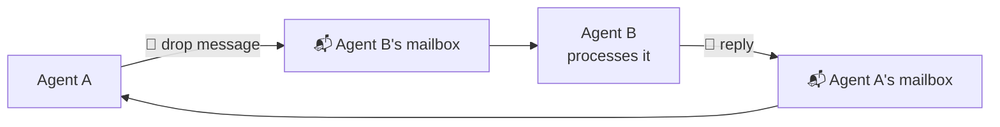
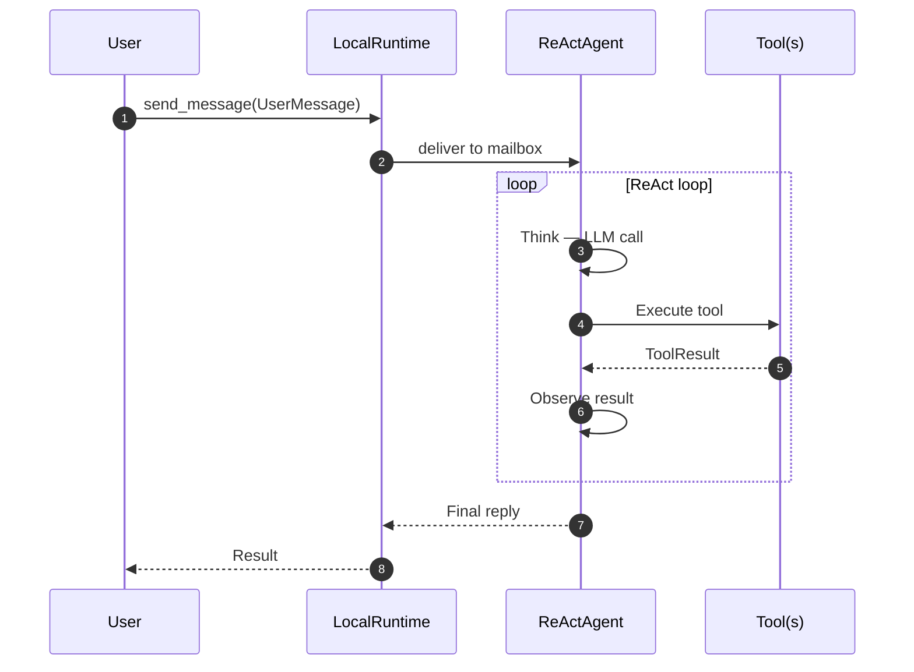
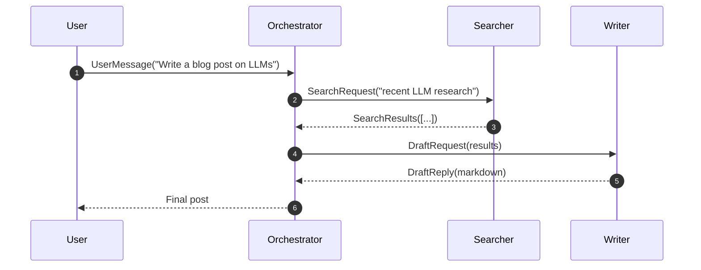
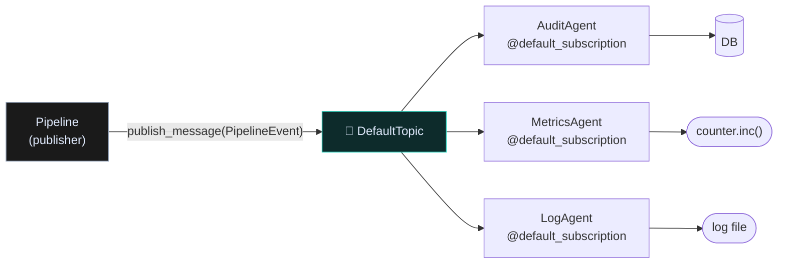
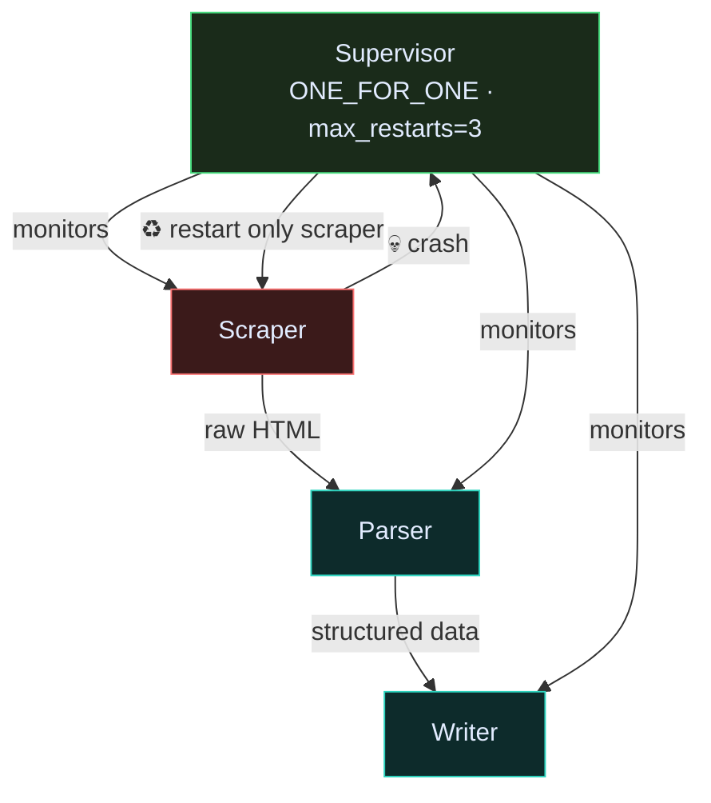
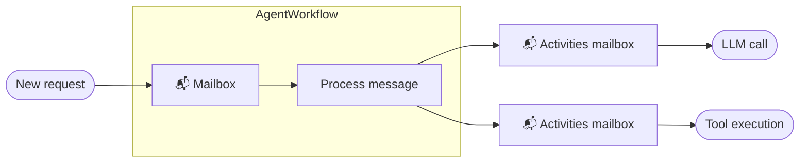
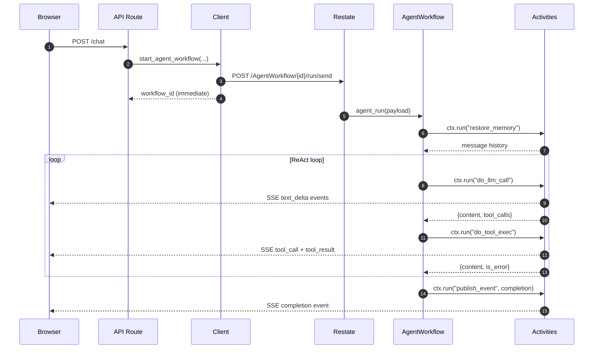
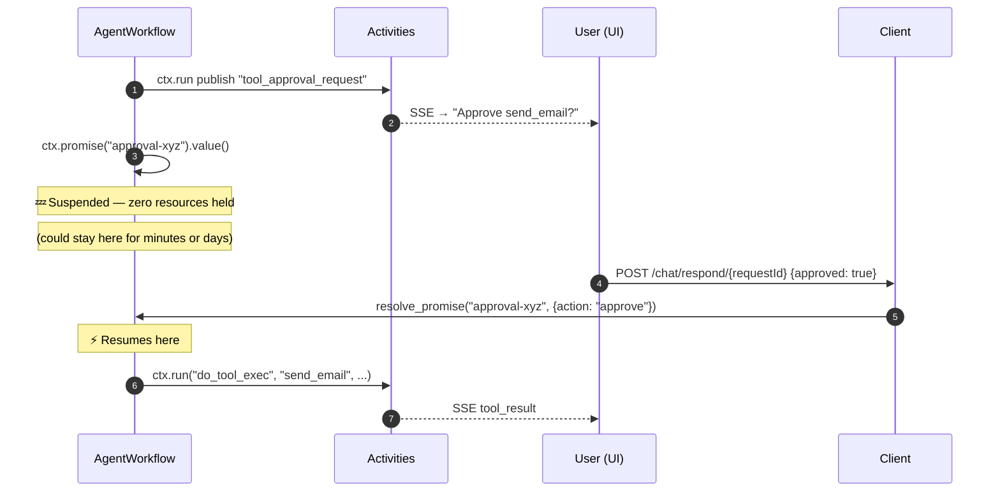
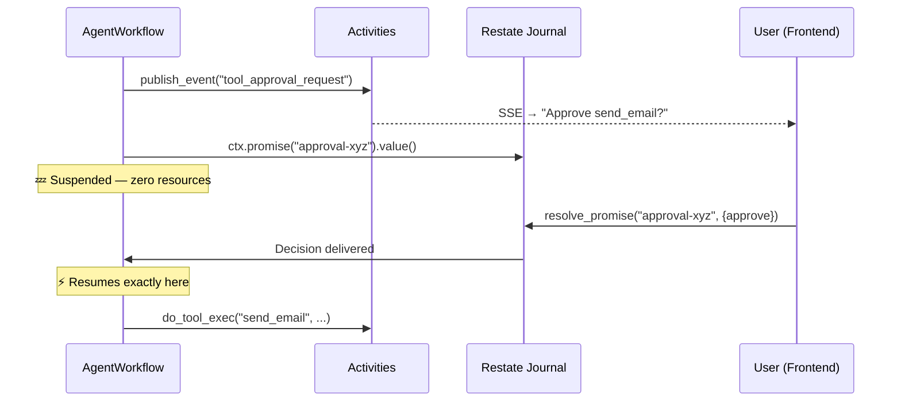
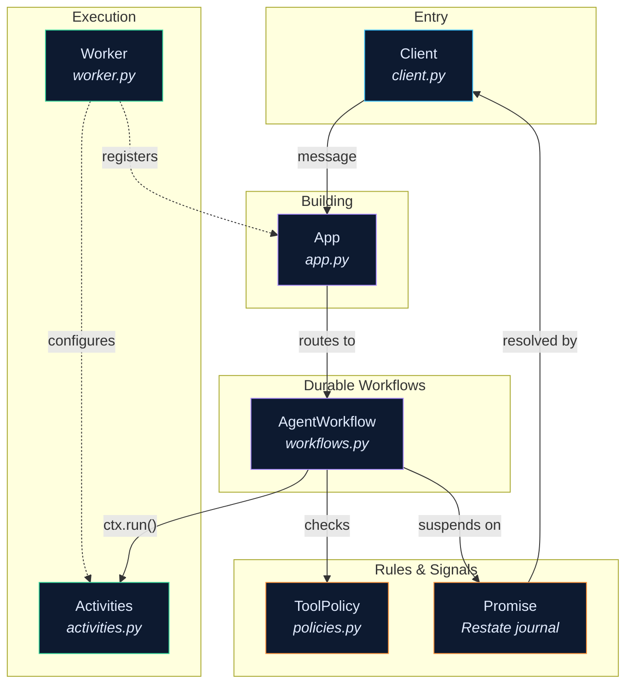

# The Runtime

Every agent in Raavan runs inside a **runtime** — the layer that lets agents talk to each other.

By default that runtime is the **LocalRuntime**: pure asyncio, zero infrastructure, runs completely in-process. No Docker, no gRPC server, no external service. Just start it, register your agents, and send messages.

When you need crash recovery, distributed pods, or durable HITL flows, you swap the runtime out for [gRPC or Restate](scaling.md) — **your agent code doesn't change**.

---

## One idea: every agent has a mailbox

An agent is not a function you call.
It's an actor with a **mailbox**. You drop a message in, the actor processes it, and replies via its own mailbox.



This model gives you three things for free:

- **Decoupling** — A doesn't wait while B is thinking; it's notified when B replies
- **Backpressure** — mailboxes are bounded; a slow consumer naturally slows the producer
- **Crash isolation** — B's crash doesn't corrupt A; A just gets an error reply

---

## LocalRuntime primitives

LocalRuntime gives you five building blocks. Everything else in the framework composes from these.

=== ":material-arrow-right-circle: Point-to-point"

    Send a message to a specific agent instance, await its reply.
    Think of it as a typed async function call between actors.

    ```python
    from raavan.core.runtime import LocalRuntime, AgentId

    runtime = LocalRuntime()

    # Register agent types
    await SummaryAgent.register(runtime, "summariser")
    await ReviewAgent.register(runtime, "reviewer")

    runtime.start()

    # Send to a specific instance
    reply = await runtime.send_message(
        SummariseRequest(text="..."),
        to=AgentId("summariser", "default"),
    )
    print(reply.summary)
    ```

    **Use when:** agent A needs a result from agent B before it can continue — a request/response chain.

=== ":material-broadcast: Pub/Sub"

    Publish a message to a **topic**. Every subscriber receives a copy independently.
    No sender knows who is listening.

    ```python
    from raavan.core.runtime import LocalRuntime, TopicId, DefaultTopicId
    from raavan.core.runtime import default_subscription, type_subscription

    @default_subscription           # auto-subscribes to "default" topic
    class Logger(RoutedAgent): ...

    @type_subscription("reviews")   # subscribes to "reviews" topic only
    class Reviewer(RoutedAgent): ...

    await Logger.register(runtime, "logger")
    await Reviewer.register(runtime, "reviewer")

    # One publish → both receive if subscribed
    await runtime.publish_message(
        TextMessage("Pipeline completed"),
        topic_id=DefaultTopicId(),
    )
    ```

    **Use when:** one agent produces an event that many agents need to react to (audit, monitoring, fan-out pipelines).

=== ":material-water: Stream"

    Ordered sequence of typed events, pushed by a producer to all subscribers.
    Ends with a `StreamDone` sentinel — consumers know the stream is closed.

    ```python
    from raavan.core.runtime import StreamPublisher

    publisher = StreamPublisher(runtime, topic_id=TopicId("llm-stream", "conv-1"))

    # Producer side: push chunks as the LLM generates
    async for chunk in model_client.stream(...):
        await publisher.publish(TextChunk(content=chunk))

    await publisher.close()   # sends StreamDone to all subscribers
    ```

    **Use when:** streaming LLM output tokens, audio chunks, or any ordered sequence of partial results.

=== ":material-restart: Supervisor"

    An agent that monitors a set of child agents and restarts them on failure — Erlang-style.
    Configurable restart budget and strategy.

    ```python
    from raavan.core.runtime import Supervisor, RestartStrategy

    supervisor = Supervisor(
        runtime=runtime,
        children=["scraper", "parser", "writer"],
        strategy=RestartStrategy.ONE_FOR_ONE,  # only restart the crashed agent
        max_restarts=5,
        window_seconds=60,
    )

    await supervisor.start()
    # If "scraper" crashes → only "scraper" is restarted
    # If it crashes >5 times in 60s → supervisor gives up and reports
    ```

    **Use when:** building resilient pipelines where one agent failing shouldn't knock out the whole system.

=== ":material-cancel: Cancellation"

    A `CancellationToken` lets you cancel an in-flight message chain cooperatively.
    Works retroactively — cancel a token you've already passed to a handler.

    ```python
    from raavan.core.runtime import CancellationToken

    token = CancellationToken()

    # Start a long-running chain
    task = asyncio.create_task(
        runtime.send_message(LongTask(...), agent_id, cancellation_token=token)
    )

    # Cancel from outside (e.g. user clicked Stop)
    token.cancel()
    # The handler receives a CancelledError at its next await point
    ```

    **Use when:** user-triggered stop, timeouts, or cascading cancel across a multi-hop agent chain.

---

## Real use cases

### 1 — Single-agent dev loop

The simplest possible setup. One agent, LocalRuntime, no extra infra. Works in a notebook, a script, or a unit test.



```python
from raavan.core.runtime import LocalRuntime

runtime = LocalRuntime()
agent = ReActAgent(tools=[WebSearchTool(), CodeTool()], model_client=client)
await agent.register(runtime, "assistant")

runtime.start()
result = await runtime.send_message(
    UserMessage("What is the current Python version?"),
    AgentId("assistant", "default"),
)
await runtime.stop_when_idle()
```

### 2 — Multi-agent pipeline (all in one process)

Multiple specialised agents, chained via the mailbox model. Each step is fully decoupled — you can add/remove agents without touching others.



```python
runtime = LocalRuntime()
await OrchestratorAgent.register(runtime, "orchestrator")
await SearchAgent.register(runtime, "searcher")
await WriterAgent.register(runtime, "writer")

runtime.start()
await runtime.send_message(
    UserMessage("Write a blog post on LLMs"),
    AgentId("orchestrator", "default"),
)
```

### 3 — Fan-out monitoring with pub/sub

Run an agent pipeline and have audit, tracing, and metrics agents watching the same events — none of them are in the critical path.



```python
@default_subscription
class AuditAgent(RoutedAgent):
    @message_handler
    async def on_event(self, msg: PipelineEvent, ctx: MessageContext) -> None:
        await self.db.insert(msg)    # never blocks the pipeline

@default_subscription
class MetricsAgent(RoutedAgent):
    @message_handler
    async def on_event(self, msg: PipelineEvent, ctx: MessageContext) -> None:
        self.counter.inc()

# Pipeline publishes once → both receive independently
await runtime.publish_message(PipelineEvent(step="search", status="done"))
```

### 4 — Resilient scraper with supervisor

A scraper → parser → writer pipeline. If the scraper crashes (flaky network), the supervisor restarts only it — the parser and writer keep going.



```python
supervisor = Supervisor(
    runtime=runtime,
    children=["scraper", "parser", "writer"],
    strategy=RestartStrategy.ONE_FOR_ONE,
    max_restarts=3,
)
await supervisor.start()
```

---

## When to stay with LocalRuntime

LocalRuntime is the right choice for most projects. You don't need distributed infrastructure until the problems below appear:

| Signal | What it means |
|---|---|
| Agents are slow to respond, but your machine is not the bottleneck | You need to scale out agents to separate machines → **gRPC** |
| A HITL approval takes minutes/hours and you redeploy in that window | Agent loses the suspended state on restart → **Restate** |
| You want exactly-once tool execution (prevent double-charge) | No journal to replay → **Restate** |
| Two teams write agents in different languages | LocalRuntime is Python-only → **gRPC** |

Ready to scale? → [Scaling Out: gRPC and Restate](scaling.md)

---

## Source

| File | What it owns |
|---|---|
| [`core/runtime/base_runtime.py`](https://github.com/Ravikumarchavva/raavan/blob/main/src/raavan/core/runtime/base_runtime.py) | `BaseRuntime` ABC — the interface all three runtimes implement |
| [`core/runtime/local_runtime.py`](https://github.com/Ravikumarchavva/raavan/blob/main/src/raavan/core/runtime/local_runtime.py) | `LocalRuntime` — asyncio mailboxes, dispatcher, pub/sub |
| [`core/runtime/supervisor.py`](https://github.com/Ravikumarchavva/raavan/blob/main/src/raavan/core/runtime/supervisor.py) | `Supervisor` — restart budget, strategies |
| [`core/runtime/stream.py`](https://github.com/Ravikumarchavva/raavan/blob/main/src/raavan/core/runtime/stream.py) | `StreamPublisher` — ordered event streams |
| [`core/runtime/cancellation.py`](https://github.com/Ravikumarchavva/raavan/blob/main/src/raavan/core/runtime/cancellation.py) | `CancellationToken` — cooperative cancellation |

---

## The one idea

Every component in this runtime is an **actor** — a named unit with a mailbox.

Actors never call each other directly. One actor drops a message in, another picks it up, does its work, and drops messages into other mailboxes.



This single property is what makes the engine **crash-safe**. Restate journals every message delivered and every result produced. If a worker dies mid-run, Restate replays the journal — the actor resumes exactly where it left off. No message is lost. No external API is called twice.

---

## The actors

Seven actors, three layers.

<div class="grid cards" markdown>

-   :material-transit-connection-variant: **Client** — `client.py`

    ---

    The only door into the runtime from outside. Tells Restate to start a workflow, query its state, cancel it, or wake a suspended workflow with an approval. Returns a `workflow_id` immediately — the real work happens asynchronously inside Restate.

-   :material-swap-horizontal: **Runtime** — `runtime.py`

    ---

    Used for agent-to-agent dispatch in multi-agent systems. Same underlying Restate ingress as the Client, but speaks a different protocol: routes a message to a named agent type rather than a specific workflow.

-   :material-layers: **Restate App** — `app.py`

    ---

    Three lines. Registers the three workflow services with Restate's SDK so the ingress knows which URL maps to which handler. The ASGI surface that uvicorn serves.

-   :material-brain: **AgentWorkflow** — `workflows.py`

    ---

    The thinker. Runs the durable ReAct loop: restore memory → call LLM → run tools → repeat. Every step is wrapped in `ctx.run()` — journaled and replay-safe. Suspends for free on HITL gates using `ctx.promise()`. No polling, no spinning.

-   :material-pipe: **PipelineWorkflow** — `workflows.py`

    ---

    Sequential adapter chain runner. Each step is a separate journal entry. Input mapping between steps resolves template references like `{{step_0.result}}`. A crash between steps only re-runs the incomplete ones.

-   :material-link-chain: **Activities** — `activities.py`

    ---

    The hands. Every unit of real side-effect work: calling the LLM, executing a tool, writing to Redis, publishing SSE events to the frontend. The only place impure work happens. Always called through `ctx.run()` — making each call crash-safe.

-   :material-wrench: **Worker** — `worker.py`

    ---

    The bootstrap. Opens the building in the morning: scans the tool catalog, creates the LLM client, connects Redis and NATS, then calls `activities.configure(...)` to inject all dependencies in one shot. Registers with Restate admin, then hands off to uvicorn.

-   :material-shield-check: **ToolPolicy** — `policies.py`

    ---

    The rulebook. Before any tool runs, the AgentWorkflow checks this for: timeout, retry limit, whether human approval is required, and whether the tool is a free-text human input gate. Trust decisions live here — not in the workflow loop, not in the tool.

</div>

---

## Follow a message — from browser to completion

You type *"Summarise the latest AI news"* and hit send. Here is every hop.

=== "Step 1 — Dispatch"

    The API route calls `RestateWorkflowClient.start_agent_workflow()`.
    The Client serialises the payload and `POST`s it to Restate's ingress. It returns a `workflow_id` immediately.

    ```
    Browser → API route → Client → Restate ingress
    ```

    ```python
    wf_id = await client.start_agent_workflow(
        thread_id="conv-abc-123",
        user_content="Summarise the latest AI news.",
        model="gpt-4o",
        max_iterations=12,
    )
    # HTTP POST /AgentWorkflow/conv-abc-123/run/send  ← returns immediately
    ```

=== "Step 2 — Routing"

    Restate routes the message to `AgentWorkflow.agent_run()` based on the service name in the URL. The journal for this workflow is created. From this moment on, every step that completes is recorded.

    ```
    Restate ingress → Restate App → AgentWorkflow.agent_run()
    ```

=== "Step 3 — Memory restore"

    The first thing the thinker does is ask Activities to hydrate the conversation history from Redis. The result is journaled — a crash here won't trigger a second Redis read on replay.

    ```python
    history = await ctx.run("restore_memory",
        activities.restore_memory, args=(thread_id,))
    # Result written to journal. Replay returns the cached value.
    ```

=== "Step 4 — Think"

    The thinker sends the history + tool schemas to Activities to call the LLM. Activities calls `model_client.generate()`, streams `text_delta` events to the frontend via NATS, and returns the LLM response. Journaled.

    ```python
    llm_result = await ctx.run(f"llm_call",
        activities.do_llm_call,
        args=(thread_id, model, tool_schemas, system_instructions))
    # {content: "...", tool_calls: [{name: "web_search", arguments: {...}}]}
    ```

=== "Step 5 — Act"

    For each tool call, the thinker checks the rulebook (`get_policy(tool_name)`), then asks Activities to execute it. Activities publishes `tool_call` and `tool_result` SSE events. Result is journaled.

    ```python
    policy = get_policy(tool_call.name)

    result = await ctx.run(f"tool_exec",
        activities.do_tool_exec,
        args=(tool_call.name, tool_call.arguments, thread_id, policy.timeout))
    # {content: "...", is_error: false}
    ```

=== "Step 6 — Loop and complete"

    Steps 4–5 repeat until the LLM returns text with no tool calls, or `max_iterations` is reached. Activities then publishes a `completion` event to the frontend.

    ```python
    await ctx.run("completion_event",
        activities.publish_event,
        args=(thread_id, {"type": "completion", "message": final_text}))
    ```

**Full sequence:**



---

## When the agent needs your approval

Some tools are dangerous — sending an email, running a query, deleting a file. The runtime handles this without polling or spinning.

**What happens:**

1. The AgentWorkflow checks `ToolPolicy` → `requires_approval = True`
2. Activities publishes a `tool_approval_request` SSE event to the frontend
3. The workflow calls `ctx.promise("approval-{id}").value()` and **suspends** — zero thread, zero memory, zero cost
4. The user clicks Approve in the UI
5. The frontend `POST`s to the HITL endpoint, which calls `client.resolve_promise(...)`
6. Restate delivers the decision into the workflow's promise slot
7. The workflow **resumes exactly at the suspension point** and executes or skips the tool



The exact same mechanism works for `ask_human` — when the agent needs free-text input from the user rather than a simple approve/deny.

---

## How the building opens

The **Worker** runs once at startup. It assembles all dependencies and injects them into Activities as module-level globals — this is the only DI moment.

```python
# worker.py — _setup() in sequence
self.model_client  = OpenAIClient(self.settings)
self.nats          = await NATSBridge.connect(self.settings.NATS_URL)
self.redis         = await RedisMemory.create_pool(self.settings.REDIS_URL)
self.tools         = self._scan_catalog()        # auto-discovers BaseTool subclasses
self.chain_runtime = ChainRuntime(self.tools)

# One-shot injection — Activities now has everything it needs
activities.configure(
    model_client  = self.model_client,
    streaming     = self.nats,
    redis         = self.redis,
    tools         = self.tools,
    chain_runtime = self.chain_runtime,
)

# Tell Restate "I am available at this URL"
await self._register_with_restate(
    f"http://host.docker.internal:{self.port}"
)
```

After this, uvicorn starts serving the Restate App. The building is open.

---

## The rulebook

Every tool lookup goes through `get_policy(tool_name)`. For known tools the policy is hardcoded; for unknown tools it is derived from the tool's `risk` and `hitl_mode` class attributes.

| Tool | Timeout | Approval | Human input | Idempotency |
|---|---|---|---|---|
| `ask_human` | 300 s | — | ✅ | — |
| `send_email` | 30 s | ✅ | — | ✅ |
| `web_surfer` | 120 s | — | — | — |
| `code_interpreter` | 300 s | — | — | — |
| *Unknown CRITICAL tool* | 30 s | ✅ | — | ✅ |
| *Unknown SENSITIVE tool* | 30 s | ✅ | — | — |
| *Unknown LOW risk tool* | 30 s | — | — | — |

```python
# policies.py — auto-derivation for tools not in the registry
def derive_policy_from_tool(tool: BaseTool) -> ToolPolicy:
    return ToolPolicy(
        requires_approval=(
            tool.risk in (ToolRisk.CRITICAL, ToolRisk.SENSITIVE)
            and tool.hitl_mode == HitlMode.BLOCKING
        ),
        needs_idempotency=(tool.risk == ToolRisk.CRITICAL),
        timeout=300 if tool.risk == ToolRisk.CRITICAL else 30,
    )
```

---

## Source files

| File | Actor | What it owns |
|---|---|---|
| [`client.py`](https://github.com/Ravikumarchavva/raavan/blob/main/src/raavan/integrations/runtime/restate/client.py) | Client | Dispatch, query, cancel, resolve promises |
| [`app.py`](https://github.com/Ravikumarchavva/raavan/blob/main/src/raavan/integrations/runtime/restate/app.py) | Restate App | ASGI surface, service registration |
| [`workflows.py`](https://github.com/Ravikumarchavva/raavan/blob/main/src/raavan/integrations/runtime/restate/workflows.py) | AgentWorkflow, PipelineWorkflow, ChainWorkflow | Durable loops + HITL promise gates |
| [`activities.py`](https://github.com/Ravikumarchavva/raavan/blob/main/src/raavan/integrations/runtime/restate/activities.py) | Activities | All side-effect work: LLM, tools, Redis, SSE |
| [`worker.py`](https://github.com/Ravikumarchavva/raavan/blob/main/src/raavan/integrations/runtime/restate/worker.py) | Worker | Bootstrap, DI injection, uvicorn host |
| [`policies.py`](https://github.com/Ravikumarchavva/raavan/blob/main/src/raavan/integrations/runtime/restate/policies.py) | ToolPolicy | Execution governance: timeouts, approval, retries |
| [`runtime.py`](https://github.com/Ravikumarchavva/raavan/blob/main/src/raavan/integrations/runtime/restate/runtime.py) | Runtime | Agent-to-agent durable dispatch |

---

## The one rule

Every actor in the runtime has a **mailbox**.
Actors never call each other directly.
They drop a message into another actor's mailbox and move on.
The receiving actor picks it up, does its work, and drops its own messages into other mailboxes.

That's the entire communication model.
It's what makes the runtime durable — if an actor crashes halfway through a message, Restate replays the mailbox from its journal and the actor picks up exactly where it left off.
No message is lost. No work is repeated.

---

## Meet the cast

Seven files, seven roles.
Think of each as a person sitting at a desk with a mailbox on it.

| Actor | One-liner | File |
|---|---|---|
| **Client** | The receptionist. Takes a request from the outside world and drops it into the right mailbox. | `client.py` |
| **App** | The building itself. Routes incoming mail to the correct desk. | `app.py` |
| **AgentWorkflow** | The thinker. Reads a user message, asks the LLM, runs tools, loops until done. | `workflows.py` |
| **Activities** | The hands. Does all the actual work — calls the LLM, runs tools, writes to memory. | `activities.py` |
| **Worker** | The janitor. Opens the building in the morning, sets up every desk, and locks up at night. | `worker.py` |
| **ToolPolicy** | The rulebook. Before any tool runs, the thinker checks the rulebook for timeouts, retries, and whether a human needs to approve. | `policies.py` |
| **Runtime** | The courier service. Used when one agent needs to send a durable message to another agent. | `runtime.py` |

---

## What happens when you send a chat message

You type *"Summarise the latest AI news"* and hit send.
Here is exactly what happens under the hood, message by message.

### Step 1 — The receptionist picks up the phone

The **Client** (`RestateWorkflowClient`) receives the request from the API route.
It wraps it into a message and drops it into the **App's** mailbox via an HTTP POST to Restate's ingress.

```python
# client.py — what the Client actually does
wf_id = await client.start_agent_workflow(
    thread_id="conv-abc-123",
    user_content="Summarise the latest AI news.",
    claims={"sub": "user-1"},
    model="gpt-4o",
    max_iterations=12,
)
# Under the hood: POST /AgentWorkflow/conv-abc-123/run/send
#   with the payload serialised as JSON.
```

The Client doesn't wait. It returns a `workflow_id` immediately.
The real work hasn't started yet.

### Step 2 — The building routes the mail

The **App** is just a Restate ASGI surface — three lines of code:

```python
# app.py — the entire file
app = restate.app(services=[
    pipeline_workflow,
    chain_workflow,
    agent_workflow,
])
```

Restate looks at the service name in the URL (`AgentWorkflow`) and drops the message into the **AgentWorkflow's** mailbox.

### Step 3 — The thinker opens the envelope

The **AgentWorkflow** (`agent_run()`) wakes up and reads the payload.
First thing it does: ask the **Activities** to restore the conversation memory from Redis.

```python
# workflows.py — first thing the thinker does
history = await ctx.run("restore_memory",
    activities.restore_memory, args=(thread_id,))
```

Notice `ctx.run()`. This is Restate's journal.
The result of `restore_memory` is recorded.
If the actor crashes and restarts, Restate replays the journal — `restore_memory` isn't called again, the saved result is returned instantly.

Every line wrapped in `ctx.run()` has this property.
**Call once, replay forever.**

### Step 4 — Think → Act → Observe (the loop)

Now the **AgentWorkflow** enters the ReAct loop.
Each iteration has three phases:

```
┌─────────────────────────────────────────────────┐
│                                                 │
│   ┌──────────┐    ┌──────────┐    ┌──────────┐  │
│   │  THINK   │───▶│   ACT    │───▶│ OBSERVE  │  │
│   │          │    │          │    │          │  │
│   │ Ask the  │    │ Run the  │    │ Record   │  │
│   │ LLM what │    │ tool it  │    │ result   │  │
│   │ to do    │    │ chose    │    │ in memory│  │
│   └──────────┘    └──────────┘    └──────────┘  │
│         ▲                               │       │
│         └───────────────────────────────┘       │
│              (repeat until LLM says done)       │
└─────────────────────────────────────────────────┘
```

**THINK** — The thinker drops a message into the Activities' mailbox: *"call the LLM with this history and these tools."*

```python
result = await ctx.run("llm_call",
    activities.do_llm_call,
    args=(thread_id, model, tool_schemas, system_instructions))
```

The Activities actor calls `model_client.generate()`, streams `text_delta` events to the frontend, and returns the LLM's response.
All journaled. A crash after this point won't re-call OpenAI.

**ACT** — If the LLM chose a tool, the thinker checks the **ToolPolicy** rulebook first:

```python
policy = get_policy(tool_call.name)
# Returns: ToolPolicy(timeout=30, requires_approval=False, ...)
```

Then drops an execution message into the Activities' mailbox:

```python
result = await ctx.run("tool_exec",
    activities.do_tool_exec,
    args=(tool_name, arguments, thread_id, policy.timeout))
```

**OBSERVE** — The Activities persist the tool result into Redis memory, and the loop continues.

If the LLM returned text with no tool calls, the loop ends.
The final answer is published as a `completion` event and streamed to the frontend.

---

## What happens when the agent needs your permission

Some tools are dangerous.
Sending an email, deleting a file, running a database query — you probably want a human to approve these first.

This is where the runtime does something clever: **it suspends the entire workflow at zero cost.**

### The mailbox trick — promises

When the **AgentWorkflow** hits a tool that requires approval, it doesn't spin-wait or poll.
It creates a **promise** — a named slot in its mailbox — and goes to sleep.

```python
# workflows.py — HITL suspension
policy = get_policy("send_email")  # requires_approval = True

# Generate a deterministic request ID (replay-safe)
request_id = str(ctx.rand.uuid4())

# Tell the frontend "hey, I need approval for this"
await ctx.run("approval_event",
    activities.publish_event,
    args=(thread_id, {
        "type": "tool_approval_request",
        "requestId": request_id,
        "tool_name": "send_email",
        "input": {"to": "boss@company.com", "subject": "Q3 Report"},
    }))

# Now suspend. No thread. No memory. No CPU. Nothing.
decision = await ctx.promise(f"approval-{request_id}").value()
```

The workflow is now frozen.
Restate has recorded the entire state in its journal.
The worker is free — it's not holding any resources.

The workflow could stay suspended for seconds, minutes, or days.
It doesn't matter.

### Waking up

The user clicks **Approve** in the UI.
The frontend `POST`s to the HITL endpoint.
The endpoint calls:

```python
# client.py — resolve_promise() delivers the answer
await client.resolve_promise(
    workflow_id="conv-abc-123",
    promise_name=f"approval-{request_id}",
    value={"action": "approve"},
)
```

Restate puts the decision into the workflow's promise slot.
The **AgentWorkflow** wakes up exactly where it left off — at the `await ctx.promise(...).value()` line — and continues:

```python
if decision["action"] == "deny":
    # Record denial, skip the tool, continue loop
    ...
else:
    # Execute the tool
    result = await ctx.run("tool_exec",
        activities.do_tool_exec, args=("send_email", ...))
```

The same mechanism handles `ask_human` — when the agent needs free-form human input instead of just approve/deny.



---

## How the building opens every morning

None of the above works without the **Worker**.
It's the first thing that runs and the last thing that stops.

When the Worker starts up:

1. Creates the LLM client (OpenAI)
2. Connects the streaming bridge (NATS) for publishing SSE events
3. Connects the Redis memory pool
4. Scans the `catalog/tools/` directory and instantiates every tool
5. Calls `activities.configure(...)` — this is the dependency injection moment.
   All the global context the Activities need is set once, here.
6. Registers itself with Restate's admin API so Restate knows where to route messages

```python
# worker.py — what _setup() does
activities.configure(
    model_client=self.model_client,
    redis=self.redis,
    tools=self.tools,
    streaming=self.nats_bridge,
    catalog=self.catalog,
    chain_runtime=self.chain_runtime,
)
await self._register_with_restate(
    f"http://host.docker.internal:{self.port}"
)
```

After setup, it starts a uvicorn server hosting the Restate **App**.
Now the building is open for business.

---

## The rulebook

Every tool has a policy.
The **ToolPolicy** decides what happens before a tool runs:

| Rule | What it controls | Example |
|---|---|---|
| `timeout` | How long the tool can run before being killed | `web_surfer: 120s` |
| `max_retries` | How many times to retry on failure | `web_surfer: 2` |
| `requires_approval` | Whether the workflow suspends for human approval | `send_email: True` |
| `is_hitl_input` | Whether the workflow suspends for human free-text input | `ask_human: True` |
| `needs_idempotency` | Whether to generate a UUID key to prevent duplicate execution | `send_email: True` |

For known tools, policies are hardcoded in a registry.
For unknown tools, the policy is **derived** from the tool's `risk` and `hitl_mode` class attributes:

```python
# policies.py — automatic derivation
def derive_policy_from_tool(tool: BaseTool) -> ToolPolicy:
    return ToolPolicy(
        requires_approval=(
            tool.risk in (ToolRisk.CRITICAL, ToolRisk.SENSITIVE)
            and tool.hitl_mode == HitlMode.BLOCKING
        ),
        needs_idempotency=(tool.risk == ToolRisk.CRITICAL),
        ...
    )
```

This keeps execution governance out of both the workflow code and the tool business logic.
The thinker doesn't decide trust.
The tool doesn't decide trust.
The rulebook does.

---

## The full picture



---

## Three things to remember

1. **Mailboxes, not function calls.** Every actor communicates through messages. Restate journals them. Crashes replay cleanly.

2. **Suspension is free.** When the agent needs human input, the workflow goes to sleep — no thread, no memory, no cost. A promise wakes it up exactly where it stopped.

3. **The rulebook is separate.** Trust decisions (approve, retry, timeout) live in `policies.py`, not in the workflow loop or the tool code. Change a policy without touching either.

---

## Source files

All seven files live in `src/raavan/integrations/runtime/restate/`:

| File | Actor | Lines |
|---|---|---|
| [`client.py`](https://github.com/Ravikumarchavva/raavan/blob/main/src/raavan/integrations/runtime/restate/client.py) | Client — dispatch, query, cancel, resolve | ~200 |
| [`app.py`](https://github.com/Ravikumarchavva/raavan/blob/main/src/raavan/integrations/runtime/restate/app.py) | App — ASGI surface | ~10 |
| [`workflows.py`](https://github.com/Ravikumarchavva/raavan/blob/main/src/raavan/integrations/runtime/restate/workflows.py) | AgentWorkflow, PipelineWorkflow, ChainWorkflow | ~250 |
| [`activities.py`](https://github.com/Ravikumarchavva/raavan/blob/main/src/raavan/integrations/runtime/restate/activities.py) | Activities — all side-effect work | ~200 |
| [`worker.py`](https://github.com/Ravikumarchavva/raavan/blob/main/src/raavan/integrations/runtime/restate/worker.py) | Worker — bootstrap + DI | ~150 |
| [`policies.py`](https://github.com/Ravikumarchavva/raavan/blob/main/src/raavan/integrations/runtime/restate/policies.py) | ToolPolicy — execution governance | ~80 |
| [`runtime.py`](https://github.com/Ravikumarchavva/raavan/blob/main/src/raavan/integrations/runtime/restate/runtime.py) | Runtime — agent-to-agent courier | ~100 |