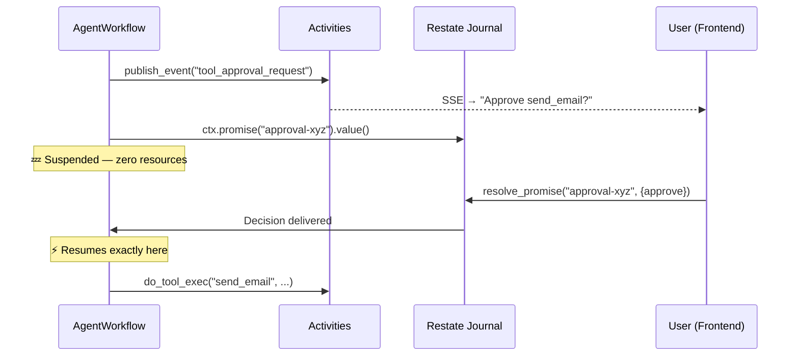
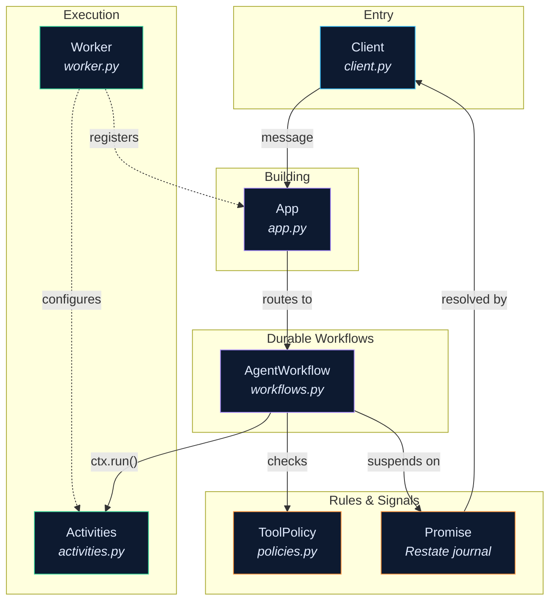

# How the Runtime Works

!!! abstract "Scope"
    Everything below is about the seven files inside
    `src/raavan/integrations/runtime/restate/`.
    No frontend, no API routes, no general architecture — just the durable engine that runs every agent turn.

---

## The one rule

Every actor in the runtime has a **mailbox**.
Actors never call each other directly.
They drop a message into another actor's mailbox and move on.
The receiving actor picks it up, does its work, and drops its own messages into other mailboxes.

That's the entire communication model.
It's what makes the runtime durable — if an actor crashes halfway through a message, Restate replays the mailbox from its journal and the actor picks up exactly where it left off.
No message is lost. No work is repeated.

---

## Meet the cast

Seven files, seven roles.
Think of each as a person sitting at a desk with a mailbox on it.

| Actor | One-liner | File |
|---|---|---|
| **Client** | The receptionist. Takes a request from the outside world and drops it into the right mailbox. | `client.py` |
| **App** | The building itself. Routes incoming mail to the correct desk. | `app.py` |
| **AgentWorkflow** | The thinker. Reads a user message, asks the LLM, runs tools, loops until done. | `workflows.py` |
| **Activities** | The hands. Does all the actual work — calls the LLM, runs tools, writes to memory. | `activities.py` |
| **Worker** | The janitor. Opens the building in the morning, sets up every desk, and locks up at night. | `worker.py` |
| **ToolPolicy** | The rulebook. Before any tool runs, the thinker checks the rulebook for timeouts, retries, and whether a human needs to approve. | `policies.py` |
| **Runtime** | The courier service. Used when one agent needs to send a durable message to another agent. | `runtime.py` |

---

## What happens when you send a chat message

You type *"Summarise the latest AI news"* and hit send.
Here is exactly what happens under the hood, message by message.

### Step 1 — The receptionist picks up the phone

The **Client** (`RestateWorkflowClient`) receives the request from the API route.
It wraps it into a message and drops it into the **App's** mailbox via an HTTP POST to Restate's ingress.

```python
# client.py — what the Client actually does
wf_id = await client.start_agent_workflow(
    thread_id="conv-abc-123",
    user_content="Summarise the latest AI news.",
    claims={"sub": "user-1"},
    model="gpt-4o",
    max_iterations=12,
)
# Under the hood: POST /AgentWorkflow/conv-abc-123/run/send
#   with the payload serialised as JSON.
```

The Client doesn't wait. It returns a `workflow_id` immediately.
The real work hasn't started yet.

### Step 2 — The building routes the mail

The **App** is just a Restate ASGI surface — three lines of code:

```python
# app.py — the entire file
app = restate.app(services=[
    pipeline_workflow,
    chain_workflow,
    agent_workflow,
])
```

Restate looks at the service name in the URL (`AgentWorkflow`) and drops the message into the **AgentWorkflow's** mailbox.

### Step 3 — The thinker opens the envelope

The **AgentWorkflow** (`agent_run()`) wakes up and reads the payload.
First thing it does: ask the **Activities** to restore the conversation memory from Redis.

```python
# workflows.py — first thing the thinker does
history = await ctx.run("restore_memory",
    activities.restore_memory, args=(thread_id,))
```

Notice `ctx.run()`. This is Restate's journal.
The result of `restore_memory` is recorded.
If the actor crashes and restarts, Restate replays the journal — `restore_memory` isn't called again, the saved result is returned instantly.

Every line wrapped in `ctx.run()` has this property.
**Call once, replay forever.**

### Step 4 — Think → Act → Observe (the loop)

Now the **AgentWorkflow** enters the ReAct loop.
Each iteration has three phases:

```
┌─────────────────────────────────────────────────┐
│                                                 │
│   ┌──────────┐    ┌──────────┐    ┌──────────┐  │
│   │  THINK   │───▶│   ACT    │───▶│ OBSERVE  │  │
│   │          │    │          │    │          │  │
│   │ Ask the  │    │ Run the  │    │ Record   │  │
│   │ LLM what │    │ tool it  │    │ result   │  │
│   │ to do    │    │ chose    │    │ in memory│  │
│   └──────────┘    └──────────┘    └──────────┘  │
│         ▲                               │       │
│         └───────────────────────────────┘       │
│              (repeat until LLM says done)       │
└─────────────────────────────────────────────────┘
```

**THINK** — The thinker drops a message into the Activities' mailbox: *"call the LLM with this history and these tools."*

```python
result = await ctx.run("llm_call",
    activities.do_llm_call,
    args=(thread_id, model, tool_schemas, system_instructions))
```

The Activities actor calls `model_client.generate()`, streams `text_delta` events to the frontend, and returns the LLM's response.
All journaled. A crash after this point won't re-call OpenAI.

**ACT** — If the LLM chose a tool, the thinker checks the **ToolPolicy** rulebook first:

```python
policy = get_policy(tool_call.name)
# Returns: ToolPolicy(timeout=30, requires_approval=False, ...)
```

Then drops an execution message into the Activities' mailbox:

```python
result = await ctx.run("tool_exec",
    activities.do_tool_exec,
    args=(tool_name, arguments, thread_id, policy.timeout))
```

**OBSERVE** — The Activities persist the tool result into Redis memory, and the loop continues.

If the LLM returned text with no tool calls, the loop ends.
The final answer is published as a `completion` event and streamed to the frontend.

---

## What happens when the agent needs your permission

Some tools are dangerous.
Sending an email, deleting a file, running a database query — you probably want a human to approve these first.

This is where the runtime does something clever: **it suspends the entire workflow at zero cost.**

### The mailbox trick — promises

When the **AgentWorkflow** hits a tool that requires approval, it doesn't spin-wait or poll.
It creates a **promise** — a named slot in its mailbox — and goes to sleep.

```python
# workflows.py — HITL suspension
policy = get_policy("send_email")  # requires_approval = True

# Generate a deterministic request ID (replay-safe)
request_id = str(ctx.rand.uuid4())

# Tell the frontend "hey, I need approval for this"
await ctx.run("approval_event",
    activities.publish_event,
    args=(thread_id, {
        "type": "tool_approval_request",
        "requestId": request_id,
        "tool_name": "send_email",
        "input": {"to": "boss@company.com", "subject": "Q3 Report"},
    }))

# Now suspend. No thread. No memory. No CPU. Nothing.
decision = await ctx.promise(f"approval-{request_id}").value()
```

The workflow is now frozen.
Restate has recorded the entire state in its journal.
The worker is free — it's not holding any resources.

The workflow could stay suspended for seconds, minutes, or days.
It doesn't matter.

### Waking up

The user clicks **Approve** in the UI.
The frontend `POST`s to the HITL endpoint.
The endpoint calls:

```python
# client.py — resolve_promise() delivers the answer
await client.resolve_promise(
    workflow_id="conv-abc-123",
    promise_name=f"approval-{request_id}",
    value={"action": "approve"},
)
```

Restate puts the decision into the workflow's promise slot.
The **AgentWorkflow** wakes up exactly where it left off — at the `await ctx.promise(...).value()` line — and continues:

```python
if decision["action"] == "deny":
    # Record denial, skip the tool, continue loop
    ...
else:
    # Execute the tool
    result = await ctx.run("tool_exec",
        activities.do_tool_exec, args=("send_email", ...))
```

The same mechanism handles `ask_human` — when the agent needs free-form human input instead of just approve/deny.



---

## How the building opens every morning

None of the above works without the **Worker**.
It's the first thing that runs and the last thing that stops.

When the Worker starts up:

1. Creates the LLM client (OpenAI)
2. Connects the streaming bridge (NATS) for publishing SSE events
3. Connects the Redis memory pool
4. Scans the `catalog/tools/` directory and instantiates every tool
5. Calls `activities.configure(...)` — this is the dependency injection moment.
   All the global context the Activities need is set once, here.
6. Registers itself with Restate's admin API so Restate knows where to route messages

```python
# worker.py — what _setup() does
activities.configure(
    model_client=self.model_client,
    redis=self.redis,
    tools=self.tools,
    streaming=self.nats_bridge,
    catalog=self.catalog,
    chain_runtime=self.chain_runtime,
)
await self._register_with_restate(
    f"http://host.docker.internal:{self.port}"
)
```

After setup, it starts a uvicorn server hosting the Restate **App**.
Now the building is open for business.

---

## The rulebook

Every tool has a policy.
The **ToolPolicy** decides what happens before a tool runs:

| Rule | What it controls | Example |
|---|---|---|
| `timeout` | How long the tool can run before being killed | `web_surfer: 120s` |
| `max_retries` | How many times to retry on failure | `web_surfer: 2` |
| `requires_approval` | Whether the workflow suspends for human approval | `send_email: True` |
| `is_hitl_input` | Whether the workflow suspends for human free-text input | `ask_human: True` |
| `needs_idempotency` | Whether to generate a UUID key to prevent duplicate execution | `send_email: True` |

For known tools, policies are hardcoded in a registry.
For unknown tools, the policy is **derived** from the tool's `risk` and `hitl_mode` class attributes:

```python
# policies.py — automatic derivation
def derive_policy_from_tool(tool: BaseTool) -> ToolPolicy:
    return ToolPolicy(
        requires_approval=(
            tool.risk in (ToolRisk.CRITICAL, ToolRisk.SENSITIVE)
            and tool.hitl_mode == HitlMode.BLOCKING
        ),
        needs_idempotency=(tool.risk == ToolRisk.CRITICAL),
        ...
    )
```

This keeps execution governance out of both the workflow code and the tool business logic.
The thinker doesn't decide trust.
The tool doesn't decide trust.
The rulebook does.

---

## The full picture



---

## Three things to remember

1. **Mailboxes, not function calls.** Every actor communicates through messages. Restate journals them. Crashes replay cleanly.

2. **Suspension is free.** When the agent needs human input, the workflow goes to sleep — no thread, no memory, no cost. A promise wakes it up exactly where it stopped.

3. **The rulebook is separate.** Trust decisions (approve, retry, timeout) live in `policies.py`, not in the workflow loop or the tool code. Change a policy without touching either.

---

## Source files

All seven files live in `src/raavan/integrations/runtime/restate/`:

| File | Actor | Lines |
|---|---|---|
| [`client.py`](https://github.com/Ravikumarchavva/raavan/blob/main/src/raavan/integrations/runtime/restate/client.py) | Client — dispatch, query, cancel, resolve | ~200 |
| [`app.py`](https://github.com/Ravikumarchavva/raavan/blob/main/src/raavan/integrations/runtime/restate/app.py) | App — ASGI surface | ~10 |
| [`workflows.py`](https://github.com/Ravikumarchavva/raavan/blob/main/src/raavan/integrations/runtime/restate/workflows.py) | AgentWorkflow, PipelineWorkflow, ChainWorkflow | ~250 |
| [`activities.py`](https://github.com/Ravikumarchavva/raavan/blob/main/src/raavan/integrations/runtime/restate/activities.py) | Activities — all side-effect work | ~200 |
| [`worker.py`](https://github.com/Ravikumarchavva/raavan/blob/main/src/raavan/integrations/runtime/restate/worker.py) | Worker — bootstrap + DI | ~150 |
| [`policies.py`](https://github.com/Ravikumarchavva/raavan/blob/main/src/raavan/integrations/runtime/restate/policies.py) | ToolPolicy — execution governance | ~80 |
| [`runtime.py`](https://github.com/Ravikumarchavva/raavan/blob/main/src/raavan/integrations/runtime/restate/runtime.py) | Runtime — agent-to-agent courier | ~100 |