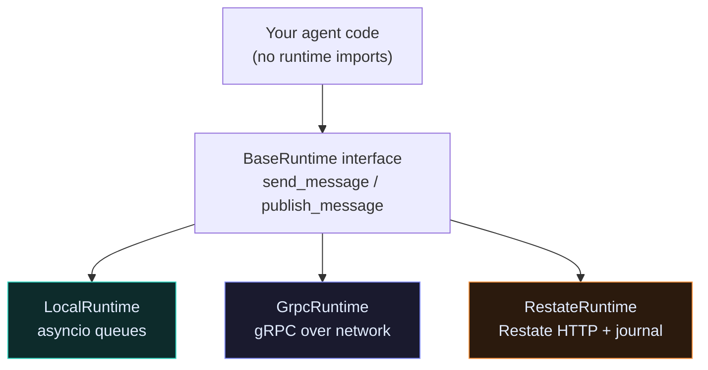
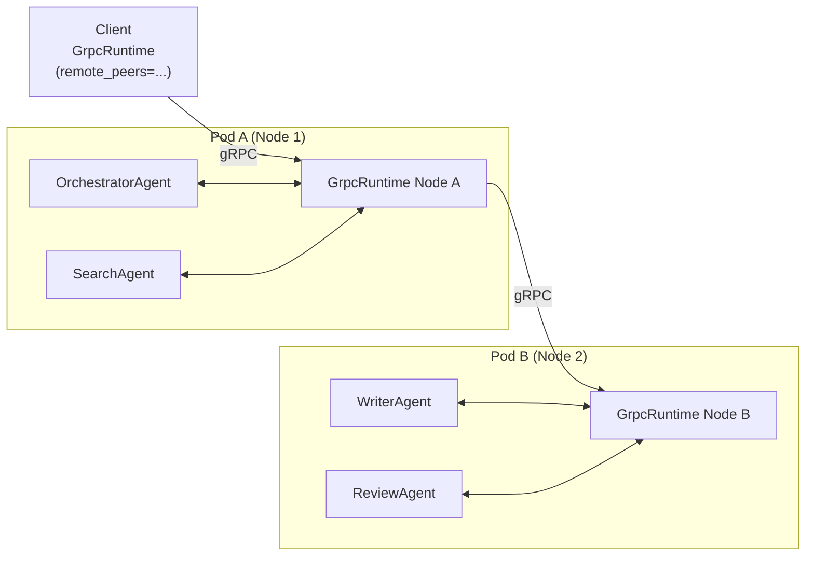
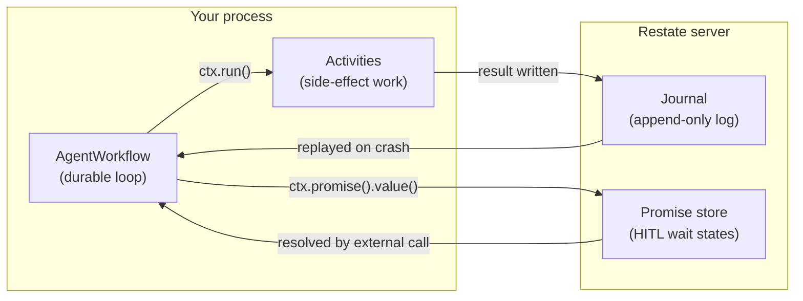
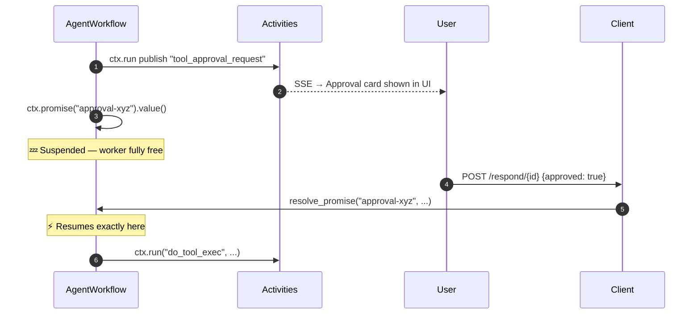
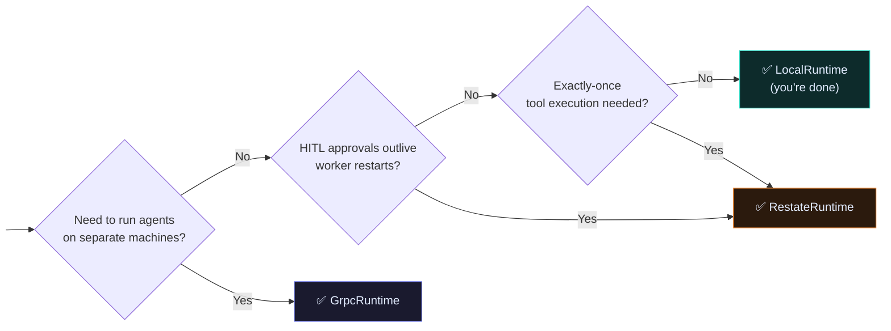

# Scaling Out

[LocalRuntime](index.md) runs everything in-process with zero infrastructure. That's where you start.

This page explains the two runtime integrations you reach for when LocalRuntime's boundaries appear — not before.

---

## The key insight: same code, different transport

All three runtimes implement the same `BaseRuntime` interface. Your agent code calls `runtime.send_message()` and `runtime.publish_message()` — it has no idea which runtime is underneath.

```python
class ReActAgent(BaseAgent):
    @message_handler
    async def on_task(self, task: Task, ctx: MessageContext) -> Result:
        # Calls runtime.send_message() internally
        # Works identically on LocalRuntime, GrpcRuntime, RestateRuntime
        return await self._run_react_loop(task)
```



Write once. Deploy anywhere.

---

## When to reach for a new runtime

| You're seeing this | Reach for |
|---|---|
| Agents need to run on separate machines / pods | **GrpcRuntime** |
| Two teams write agents in different languages | **GrpcRuntime** |
| You want to horizontally scale a specific agent type | **GrpcRuntime** |
| A HITL approval can outlive a worker restart | **RestateRuntime** |
| You need exactly-once tool execution (no double-charge) | **RestateRuntime** |
| A multi-step workflow must survive infrastructure crashes | **RestateRuntime** |

---

## GrpcRuntime

Source: `src/raavan/integrations/runtime/grpc/`

GrpcRuntime makes agent mailboxes **network-addressable**. Each agent type runs as a gRPC servicer. `send_message()` becomes a unary gRPC call across the network. `publish_message()` becomes a server-streaming push.



**What changes vs LocalRuntime:**

- Each runtime node runs as a separate process (a pod in Kubernetes)
- `send_message()` serialises the message as JSON and sends it over the network
- Agent code is **unchanged** — handlers don't import gRPC anything

**What stays the same:**

- Same `register()`, `send_message()`, `publish_message()` API
- Same message types

### Setting it up

```python
from raavan.integrations.runtime.grpc import GrpcRuntime

# Node A (runs in Pod A)
runtime_a = GrpcRuntime(
    host="0.0.0.0",
    port=50051,
    remote_peers={
        "node-b": "pod-b-svc:50051",   # can forward to Node B
    }
)
await SearchAgent.register(runtime_a, "searcher")
await OrchestratorAgent.register(runtime_a, "orchestrator")
await runtime_a.start()

# Node B (runs in Pod B)
runtime_b = GrpcRuntime(
    host="0.0.0.0",
    port=50051,
    remote_peers={
        "node-a": "pod-a-svc:50051",
    }
)
await WriterAgent.register(runtime_b, "writer")
await runtime_b.start()
```

The orchestrator on Node A calls `send_message(WriteRequest(...), AgentId("writer", "default"))` — GrpcRuntime sees that `writer` is on a remote peer and routes the call over gRPC transparently.

### Trade-offs

| Benefit | Limitation |
|---|---|
| Horizontal scaling — add more writer pods under a load balancer | No crash recovery — pod crash loses all in-flight messages |
| Language interop — any gRPC client is an agent | Higher latency (~5–50 ms per hop vs <1 ms local) |
| Isolate heavy workloads to dedicated machines | HITL state is lost if the pod restarts mid-approval |

**GrpcRuntime is stateless by design.** If exactly-once execution or durable HITL flow matters, use Restate instead.

---

## RestateRuntime

Source: `src/raavan/integrations/runtime/restate/`

RestateRuntime wraps every agent step in a **durable journal**. Restate records the result of every activity the moment it completes. If the worker crashes and restarts, Restate replays the journal — completed steps are skipped, the in-progress step retries from the beginning.



**What Restate adds:**

Every `ctx.run("step_name", fn, args)` call:

1. First time: runs `fn(args)`, records the result in the journal
2. On replay (after a crash): returns the recorded result immediately — `fn` is never called again

This makes the workflow **idempotent by default** — the LLM is called once, the tool runs once, the email is sent once.

### The HITL promise pattern

RestateRuntime's standout feature: zero-cost workflow suspension.

When an agent hits a tool that requires human approval, it suspends with `ctx.promise("approval-xyz").value()`. The worker is completely free — no thread, no memory, no cost. The workflow can stay suspended for minutes, hours, or days. When the user approves, `resolve_promise()` wakes it up exactly where it stopped.



### Setting it up

```python
from raavan.integrations.runtime.restate import RestateWorkflowClient

client = RestateWorkflowClient(settings)
await client.connect()

# Dispatch a durable agent run
wf_id = await client.start_agent_workflow(
    thread_id="conv-abc",
    user_content="Summarise Q3 financials.",
    model="gpt-4o",
    max_iterations=10,
)

# Query status at any time
state = await client.query_workflow(wf_id)

# Resolve a pending HITL promise
await client.resolve_promise(
    workflow_id=wf_id,
    promise_name=f"approval-{request_id}",
    value={"action": "approve"},
)
```

The implementation lives in `src/raavan/integrations/runtime/restate/`.

### Trade-offs

| Benefit | Limitation |
|---|---|
| Crash recovery — workflow resumes transparently | Requires Restate server deployment |
| Exactly-once tool execution via journaling | Higher latency per step (~10–100 ms journaling overhead) |
| HITL promises survive worker restarts | Steeper learning curve (ctx.run, promises) |
| Replay skips already-completed steps | Not suitable for latency-sensitive (<10 ms) workloads |

---

## Decision matrix

| | LocalRuntime | GrpcRuntime | RestateRuntime |
|---|:---:|:---:|:---:|
| **Infrastructure** | None | gRPC server | Restate server |
| **Latency per hop** | &lt; 1 ms | 5–50 ms | 10–100 ms |
| **Horizontal scale** | ✗ | ✅ | ✅ (workers) |
| **Crash recovery** | ✗ | ✗ | ✅ |
| **Exactly-once tools** | ✗ | ✗ | ✅ |
| **Durable HITL** | ✗ | ✗ | ✅ |
| **Language interop** | Python only | Any gRPC lang | Python only |
| **Setup complexity** | Zero | Medium | High |
| **Best for** | Dev / monolith | Multi-pod K8s | Durable flows |



---

## You probably don't need this yet

Most production deployments run just fine on LocalRuntime inside a monolith. The framework's monolith server (`src/raavan/server/`) does exactly that — all agents run in the same process, dispatching through LocalRuntime internally.

Reach for GrpcRuntime or RestateRuntime when a concrete production problem forces your hand — not before.
