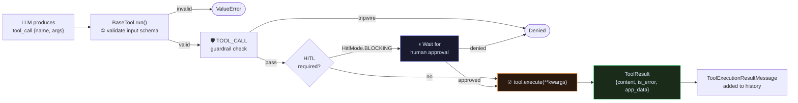
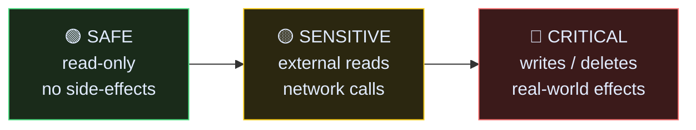
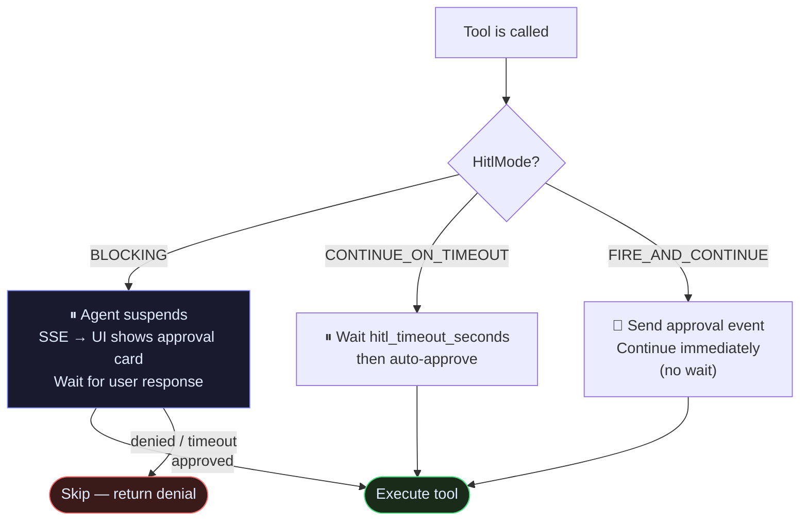
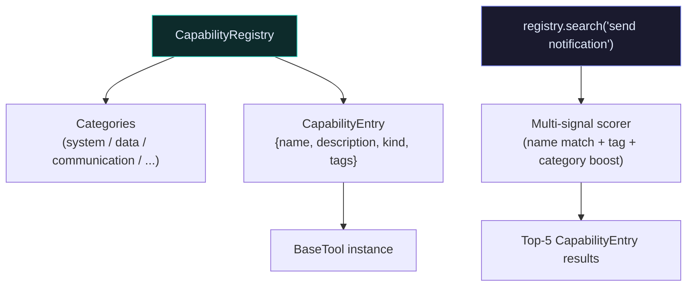

# Tools

A tool is a unit of side-effect work the LLM asks for and the agent delivers.

The LLM never executes code directly. It produces a tool call — a name and arguments. The agent validates the call, checks guardrails, asks the user if the tool is guarded, then runs `tool.execute()`. The result goes back into the conversation as a `ToolExecutionResultMessage`.

---

## Tool call lifecycle



---

## Subclassing BaseTool

Every tool subclasses `BaseTool`. Set `risk` and `hitl_mode` as **class-level attributes** — the agent reads them before executing.

```python
from raavan.core.tools.base_tool import BaseTool, ToolResult, ToolRisk, HitlMode

class SendEmailTool(BaseTool):
    risk      = ToolRisk.CRITICAL       # Strategy: class-level
    hitl_mode = HitlMode.BLOCKING       # Agent suspends until user approves

    def __init__(self):
        super().__init__(
            name="send_email",
            description="Send an email to a recipient",
            input_schema={
                "type": "object",
                "properties": {
                    "to":      {"type": "string", "description": "Recipient email"},
                    "subject": {"type": "string"},
                    "body":    {"type": "string"},
                },
                "required": ["to", "subject", "body"],
            },
        )

    async def execute(self, *, to: str, subject: str, body: str) -> ToolResult:  # type: ignore[override]
        await email_service.send(to=to, subject=subject, body=body)
        return ToolResult(
            content=[{"type": "text", "text": f"Email sent to {to}"}],
            app_data={"recipients": [to]},   # ← use app_data, not metadata
        )
```

---

## ToolRisk — the trust ladder



| Risk | Examples | Default HITL |
|---|---|---|
| `ToolRisk.SAFE` | `web_search`, `read_file`, `calculator` | None |
| `ToolRisk.SENSITIVE` | `http_get`, `database_read`, `list_files` | None |
| `ToolRisk.CRITICAL` | `send_email`, `delete_file`, `run_sql_write` | `HitlMode.BLOCKING` |

---

## HitlMode — how approval works



---

## Schema methods

A tool exposes three schema formats — use the right one for each consumer:

| Method | Returns | Use for |
|---|---|---|
| `tool.get_schema()` | `Tool` (framework) | `ReActAgent(tools=[...])` |
| `tool.get_openai_schema()` | `dict` (OpenAI format) | `client.generate(tools=[...])` |
| `tool.get_mcp_schema()` | `dict` (MCP wire) | MCP protocol / debugging |

---

## CapabilityRegistry

The agent auto-discovers and searches tools through `CapabilityRegistry`. Register your tools and the agent uses fuzzy search to surface the right one.



```python
from raavan.core.tools.catalog import CapabilityRegistry

registry = CapabilityRegistry()

# Register
registry.register_tool(
    SendEmailTool(),
    category="communication",
    tags=["email", "notify"],
)

# Lookup by name or alias
tool = registry.get_tool("send_email")

# Fuzzy search
results = registry.search("send a notification", limit=5)

# Browse a category
tools = registry.browse("communication")

# All tools at a given risk level
risky = registry.by_risk(ToolRisk.CRITICAL)
```

### Built-in categories

`system` · `communication` · `data` · `data/visualization` · `data/exploration` · `data/management` · `development` · `development/execution` · `development/project` · `research` · `creative` · `media` · `productivity`

---

## Source

| File | What it owns |
|---|---|
| [`core/tools/base_tool.py`](https://github.com/Ravikumarchavva/raavan/blob/main/src/raavan/core/tools/base_tool.py) | `BaseTool`, `ToolResult`, `ToolCall`, `ToolRisk`, `HitlMode` |
| [`core/tools/catalog.py`](https://github.com/Ravikumarchavva/raavan/blob/main/src/raavan/core/tools/catalog.py) | `CapabilityRegistry`, `CapabilityEntry`, `CategoryNode` |
| [`core/tools/registry.py`](https://github.com/Ravikumarchavva/raavan/blob/main/src/raavan/core/tools/registry.py) | `ToolRegistry` — global singleton |
| [`catalog/tools/`](https://github.com/Ravikumarchavva/raavan/blob/main/src/raavan/catalog/tools/) | Built-in tool implementations |
