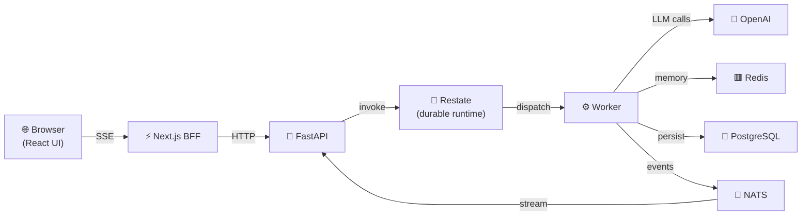

---
hide:
  - navigation
  - toc
---

# Raavan Agent Framework

<div class="grid cards" markdown>

-   :material-rocket-launch-outline: **Get started in minutes**

    ---

    Install with `uv`, connect to OpenAI, and run your first ReAct agent in under 5 minutes.

    [:octicons-arrow-right-24: Quick Start](getting-started/quickstart.md)

-   :material-robot-outline: **Multiple agent types**

    ---

    ReAct, Orchestrator, FlowAgent, and Pipeline agents — pick the right loop for your use case.

    [:octicons-arrow-right-24: Core Concepts](concepts/index.md)

-   :material-tools: **60+ built-in tools**

    ---

    Web browsing, code execution, file management, task tracking, email, and MCP protocol support.

    [:octicons-arrow-right-24: Tools Reference](tools/index.md)

-   :material-shield-check-outline: **HITL + Guardrails**

    ---

    Content filtering, PII detection, prompt injection guards, and human-in-the-loop approvals baked in.

    [:octicons-arrow-right-24: Guardrails](concepts/guardrails.md)

-   :material-database-clock-outline: **Durable execution**

    ---

    Restate-backed workflows — crash-safe, exactly-once tool execution, automatic replay.

    [:octicons-arrow-right-24: Durable Runtime](runtime/index.md)

-   :material-chart-line: **Full observability**

    ---

    OpenTelemetry traces, structured logs to Loki, Grafana dashboards out of the box.

    [:octicons-arrow-right-24: Observability](observability/index.md)

</div>

---

## Installation

=== "uv (recommended)"

    ```bash
    git clone https://github.com/Ravikumarchavva/raavan.git
    cd raavan
    uv sync
    ```

=== "with extras"

    ```bash
    # Notebook support
    uv sync --group notebooks

    # Browser automation
    uv sync --group browser

    # S3 / object storage
    uv sync --group storage
    ```

---

## Your first agent

```python
import asyncio
from raavan.core.agents.react_agent import ReActAgent
from raavan.core.memory import UnboundedMemory
from raavan.integrations.llm.openai.openai_client import OpenAIClient

async def main():
    client = OpenAIClient(api_key="sk-...", model="gpt-4o")
    memory = UnboundedMemory()
    agent = ReActAgent(model_client=client, memory=memory, tools=[])

    reply = await agent.run("What is 17 * 23?")
    print(reply)

asyncio.run(main())
```

---

## Architecture at a glance



---

## Why Raavan?

| Feature | Raavan | LangChain | LlamaIndex | Google ADK |
|---|---|---|---|---|
| Durable execution (crash-safe) | ✅ Restate | ❌ | ❌ | ❌ |
| Human-in-the-loop | ✅ native | ⚠️ DIY | ⚠️ DIY | ✅ |
| MCP tool support | ✅ | ✅ | ✅ | ✅ |
| Async-first | ✅ | ⚠️ partial | ⚠️ partial | ✅ |
| Streaming UI | ✅ SSE | ⚠️ | ⚠️ | ✅ |
| Built-in eval framework | ✅ | ⚠️ | ✅ | ✅ |
| Observability (OTEL) | ✅ native | ⚠️ plugin | ⚠️ plugin | ✅ |

---

## Notebooks

Explore the [`examples/`](https://github.com/Ravikumarchavva/raavan/tree/main/examples) folder for 20 Jupyter notebooks covering everything from basic agents to Kubernetes deployments.
