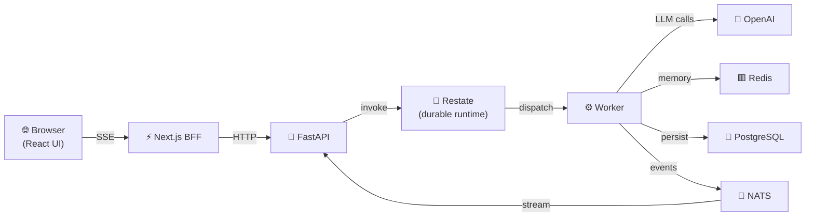

---
hide:
# Raavan Agent Framework

Production-ready infrastructure for building agent systems that can reason, call tools, stream progress, wait for humans, and resume safely after failures.

<div class="grid cards" markdown>

-   :material-rocket-launch-outline: **Start in 5 minutes**

    ---

    Install the framework, create your first agent, and understand the request lifecycle without reading the whole codebase.

    [:octicons-arrow-right-24: Getting Started](getting-started/index.md)

-   :material-graph-outline: **Understand the architecture**

    ---

    See how the UI, FastAPI, Restate runtime, worker activities, memory, and SSE streaming fit together.

    [:octicons-arrow-right-24: Architecture](architecture/index.md)

-   :material-tools: **Build with tools and HITL**

    ---

    Add tools, approvals, human input, and MCP integrations using the same patterns the framework already uses internally.

    [:octicons-arrow-right-24: Tutorials](tutorials/index.md)

-   :material-database-clock-outline: **Ship durable agents**

    ---

    Move from an in-process agent to a Restate-backed runtime with resumable workflows and exactly-once execution.

    [:octicons-arrow-right-24: Durable Runtime](concepts/durable-runtime.md)

-   :material-chart-line: **Operate in production**

    ---

    Run locally, deploy with Docker or Kind, and inspect logs, traces, and metrics with the built-in observability stack.

    [:octicons-arrow-right-24: Operate](operate/index.md)

</div>

---

## Developer Journey

1. Start with [Installation](getting-started/installation.md) and [Quickstart](getting-started/quickstart.md).
2. Learn the runtime model in [Agent Lifecycle](concepts/agent-lifecycle.md) and [Streaming And Events](concepts/streaming-and-events.md).
3. Extend the system with [Create A Tool](tutorials/create-tool.md) and [Connect MCP Tools](tutorials/mcp-tools.md).
4. Move to the durable flow in [First Durable Run](getting-started/first-runtime.md) and [Local And Kind](deploy/local-and-kind.md).
5. Use [Observability](operate/observability.md) and [Runbook](operate/runbook.md) when you deploy or debug.

</div>

---

## Installation

=== "uv (recommended)"

    ```bash
    git clone https://github.com/Ravikumarchavva/raavan.git
    cd raavan
    uv sync
    ```

=== "with extras"

    ```bash
    # Notebook support
    uv sync --group notebooks

    # Browser automation
    uv sync --group browser

    # S3 / object storage
    uv sync --group storage
    ```

---

## Your first agent

```python
import asyncio
from raavan.core.agents.react_agent import ReActAgent
from raavan.core.memory import UnboundedMemory
from raavan.integrations.llm.openai.openai_client import OpenAIClient

async def main():
    client = OpenAIClient(api_key="sk-...", model="gpt-4o")
    memory = UnboundedMemory()
    agent = ReActAgent(model_client=client, memory=memory, tools=[])

    reply = await agent.run("What is 17 * 23?")
    print(reply)

asyncio.run(main())
```

---

## Architecture at a glance



---

## Why Raavan?

| Feature | Raavan | LangChain | LlamaIndex | Google ADK |
|---|---|---|---|---|
| Durable execution (crash-safe) | ✅ Restate | ❌ | ❌ | ❌ |
| Human-in-the-loop | ✅ native | ⚠️ DIY | ⚠️ DIY | ✅ |
| MCP tool support | ✅ | ✅ | ✅ | ✅ |
| Async-first | ✅ | ⚠️ partial | ⚠️ partial | ✅ |
| Streaming UI | ✅ SSE | ⚠️ | ⚠️ | ✅ |
| Built-in eval framework | ✅ | ⚠️ | ✅ | ✅ |
| Observability (OTEL) | ✅ native | ⚠️ plugin | ⚠️ plugin | ✅ |

---

## Notebooks

Explore the [`examples/`](https://github.com/Ravikumarchavva/raavan/tree/main/examples) folder for 20 Jupyter notebooks covering everything from basic agents to Kubernetes deployments.

For deeper historical design notes, planning documents, and the interactive legacy explorer, see [Archive](archive/index.md).
